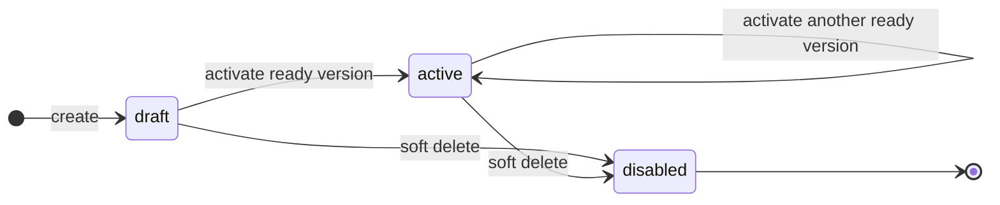
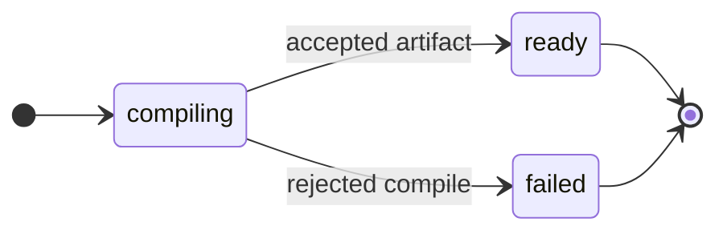
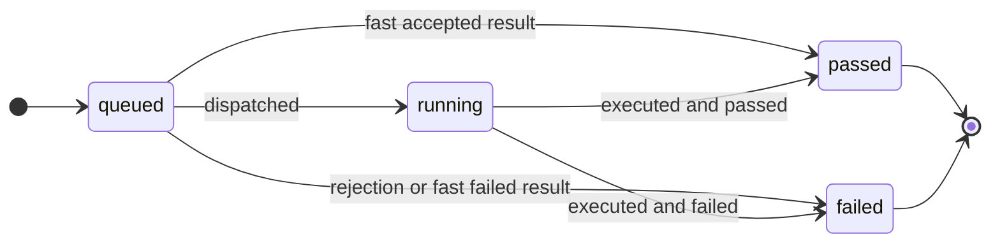
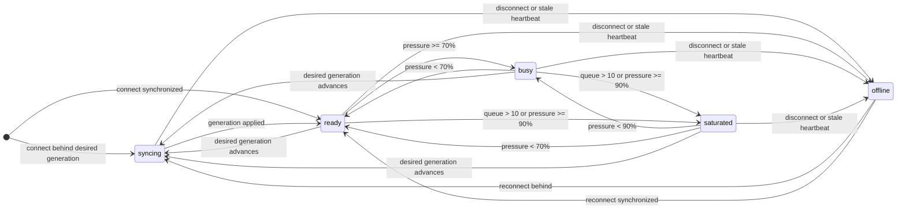
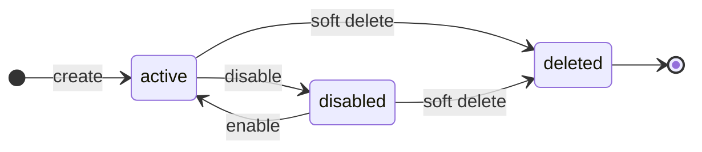

# Guard Controller and Guard Runner

## Decision

TaskLattice Guard has exactly two application component types:

1. **Guard Controller** is the TypeScript control plane. It serves the React
   and TanStack management UI, delegates human identity to Better Auth, owns
   PostgreSQL state, creates desired generations, reconciles Runner state,
   retains audit/runtime metadata, and evaluates pool capacity.
2. **Guard Runner** is the Python data plane. It receives immutable signed
   artifacts, instantiates NVIDIA NeMo Guardrails, authenticates Integration
   requests locally, serves traffic, and exports load/telemetry summaries.

`GuardRails 0` is the mandatory baseline runtime and authoritative NeMo
compiler. The wire/storage ID `default` remains internal compatibility state;
it is not a product or Kubernetes name. This is a Runner role, not a third
component.

## Deployment topology

The smallest highly available installation contains three application Pods:

```text
1 × Guard Controller
2 × GuardRails 0 Runner (internal pool=default, compiler-capable=true)
```

Additional pool replicas are more Guard Runner Pods. Controller is deployed as
one replica in this release. Every Runner pool is a StatefulSet, so an instance
keeps the same ordinal Pod name and Runner ID across restarts and image rollouts.
GuardRails 0 has two desired replicas and `minAvailable: 1`; ordered rolling
replacement therefore retains a ready data-plane endpoint. Runner pools may
scale horizontally. A pool with more than one replica must use Redis for shared
input/output call-version pinning.

PostgreSQL, Redis, and observability backends are dependencies, not additional
TaskLattice Guard application components.

Each pool is addressed by a stable logical Runtime Service. Pod names and
Runner identities are control-plane observability details and are not exposed
to upstreams. Kubernetes uses ordinary balancing (`sessionAffinity: None`);
`call_id` plus the required Redis context provides input/output generation
pinning when a pool has multiple replicas. A separate private headless Service
governs StatefulSet identity and is never used as the Integration endpoint.

The LiteLLM adapter exposes the LiteLLM Basic Guardrail API below the stable
Integration base URL. It converts LiteLLM request/response callbacks into the
Runner's internal protection contract and maps decisions back to `NONE`,
`BLOCKED`, or `GUARDRAIL_INTERVENED`.

## Source ownership

| Directory | Owner | Contents |
| --- | --- | --- |
| `controller/` | Controller | React/TanStack UI, Hono API, Better Auth, Drizzle schema/migrations, reconciliation |
| `runner/` | Runner | FastAPI host, control client, telemetry, artifact store, NeMo compiler/runtime toolkit |
| `proto/` | Shared transport contract | Versioned, strongly typed Controller/Runner gRPC protocol |
| `scripts/` | Contract generation | Deterministic language binding generation and stale-output checks for Proto contracts |
| `charts/` | Deployment | Images, dependencies, Secrets, Services and workload topology |

The Runner-only NeMo code is nested under `runner/toolkit/`; it is not a third
service or a Python control plane. Controller contains no Python/NeMo runtime
code, while Runner receives no Controller database or human-authentication
code.

## Ownership boundary

| Concern | Controller | Runner |
| --- | --- | --- |
| React/TanStack UI | Owns | None |
| Users, sessions, roles | Better Auth | None |
| Guardrail/Integration desired state | Owns | Read-only projection |
| NeMo compilation | Dispatches and signs | GuardRails 0 compiles |
| Runtime authentication | Issues verifier | Enforces locally |
| Runtime traffic | Never in hot path | Owns |
| Audit and runtime metadata retention | Owns | WAL and batch export |
| Capacity | Aggregates and recommends | Reports load |

Runner never receives database credentials. Controller never loads NeMo or
serves a protection request.

## Control protocol

Runner initiates a long-lived gRPC connection to Controller. Production uses a
Runner token plus mutual TLS. A stream begins with registration, followed by
heartbeat/load reports, artifact ACK/NACK messages, and compile results.

The checked-in files under `proto/tasklattice/guard/control/v1/` are the single
source of truth for every value transported between Controller and Runner. The
protocol is split by domain while keeping one versioned package:

- `runner_control.proto` owns the stream service and message envelopes.
- `runtime.proto` owns the immutable Guardrail Plan and policy bindings.
- `artifact.proto` owns compilation requests/results and signed artifacts.
- `evaluation.proto` owns findings and runtime trace evidence.
- `routing.proto` and `integration.proto` own traffic selection and runtime
  authentication projections.
- `validation.proto` owns validation requests, cases, metrics, and results.
- `common.proto` owns enums reused across those domains.
- `enforcement_action.proto` owns the closed post-evaluation vocabulary used by
  the protocol, UI, HTTP DTOs, and Python runtime. Its declaration order is the
  product display order, its numeric values are conflict priorities, and its
  comments are the canonical semantic descriptions.

Business objects are typed messages and enums; the stream does not embed JSON
documents. Registry identifiers such as adapter names and runtime profiles
remain strings so a new Provider or model implementation can be plugged in
without changing the protocol. `config_yaml` and `colang_content` are compiled
NeMo artifacts, not alternate business-object encodings, and therefore remain
opaque text payloads.

Protocol comments are part of the contract and are emitted into generated
language documentation. Every top-level message, enum, and service must explain
its domain role. Every optional field must define what absence means, and fields
carrying time, units, ranges, deltas, generations, signatures, or result-state
semantics must document those constraints. Descriptor-based tests enforce this
minimum; obvious identifiers may remain self-describing.

Generated Python bindings live under `runner/generated/`. Generated TypeScript
types live under `controller/server/generated/control-protocol/`. Application
code imports those outputs and translates domain objects only in the two
protocol boundary codecs; it must not hand-maintain a second wire interface.
The lowercase TypeScript and Python `EnforcementAction` helpers are also
generated directly from the Proto descriptor; they are not a second contract.
Run `make proto-generate` after changing a contract and `make proto-check` in CI
to reject stale generated code. This release intentionally has no legacy wire
fields or dual-read/dual-write compatibility path.

Controller sends desired generations, signed artifacts, compile commands, and
drain commands. A Runner verifies checksum and Ed25519 signature, stages and
prewarms every referenced artifact, and then atomically changes generation.
NACK leaves the previous generation active. The last-known-good desired state
is persisted locally so temporary Controller outages do not interrupt traffic.

PostgreSQL desired state is authoritative; the stream accelerates convergence.

## State ownership and lifecycles

State names have one owner and one semantic axis:

- Controller persistence, HTTP DTOs, and UI projections import their
  vocabulary from `controller/shared/lifecycle.ts`.
- Values transported between Controller and Runner are defined only in Proto.
- A lifecycle state is stored and changes through commands. A projection is
  recomputed from other facts and must not be treated as a writable lifecycle.

Guardrail resource state and immutable version state are separate. Compiling a
new version does not take an already active Guardrail out of service.





Validation runs are persisted independently from Guardrail publication. A
Runner result can win the race with the best-effort `running` write, so direct
queued-to-terminal completion is part of the contract rather than an invalid
state.



Runner status is a compact projection of two axes. `syncing` and `offline`
describe reconciliation/connectivity. Once synchronized, `ready`, `busy`, and
`saturated` describe pressure. Registration is a stream event, not a durable
state.



An Integration's `active`/`disabled` lifecycle is a reversible operational
toggle. Soft deletion is a separate terminal overlay (`deleted_at` plus
`status=disabled`), after which enable/disable commands no longer select it.



The UI's Guardrail readiness is a derived view, not another state machine:

| Derived value | Exact condition |
| --- | --- |
| `needs_validation` | The active version does not represent the current draft. |
| `ready` | The current draft is active, with no enabled deployment. |
| `protected` | The current draft is active, with at least one enabled deployment. |

Similarly, `not_run` is an empty validation-history projection rather than a
persisted validation state. Integration setup progress is separate from the
Integration lifecycle.

## Guardrail publication

1. An administrator selects product protections in Controller.
2. Controller creates a canonical immutable plan. The browser cannot submit raw
   NeMo YAML or Colang.
3. Publication requires a healthy GuardRails 0 Runner.
4. GuardRails 0 compiles through the pinned NeMo toolkit.
5. Controller verifies the returned checksum, signs the artifact, stores it,
   and advances desired generation.
6. Target Runner pools prewarm and ACK the generation before it becomes ready.

## NeMo evaluation boundary

NeMo Guardrails remains the Runner's core rail and Action runtime. Product
capabilities do not require one NeMo Action class per risk. New artifacts bind
PII, content-safety, and jailbreak Evaluation Contracts to one versioned Action:

```text
Policy Template / Guardrail Draft
                |
                v
     Evaluation Contract graph
      | contract_ref + trigger
      |-- tali.guard.pii.exact.v1 ----------> local PII evaluator
      |        `-- uncertain triggers semantic contract
      |-- tali.guard.pii.semantic.v1 -------+
      |-- tali.guard.content-safety.v1 -----+--> GuardEvaluateAction@1.0.0
      `-- tali.guard.jailbreak.v1 ----------+            |
                                                         v
                                              Evaluator Binding
                                        profile_ref + model_ref + priority
                                                         |
                                   +---------------------+------------------+
                                   |                                        |
                                   v                                        v
                         Evaluator Profile                         Model Runtime
                    prompt / parser / contracts            endpoint / client / model
                                   |                                        |
                                   +---------------------+------------------+
                                                         |
                                                         v
                                              Model client or test mock
```

The Evaluation Contract is the stable product/runtime boundary. A trigger graph
expresses when a dependent contract runs; it does not imply that every request
must call both a local evaluator and a model. Exact local PII findings stop the
graph immediately, ordinary text stays local, and only an `uncertain` result
activates `tali.guard.pii.semantic.v1`.

The Evaluator Binding owns compatibility and fallback scope. Qwen3Guard's
profile supports content safety, jailbreak, and semantic PII. Llama Guard 3's
profile currently supports content safety only. Consequently Llama can be a
lower-priority binding for `tali.guard.content-safety.v1`, but it cannot be a
global backup for the Qwen jailbreak or PII bindings. The Runner rejects a
binding when its Profile does not declare the requested contract.

Model-family semantics and transport are separate plugins. A
`ConfiguredSafetyModelProvider` composes one `ModelProtocolAdapter` (prompt and
response parsing) with one `ModelClient` (I/O). The built-in deployment client
is selected from the Evaluator Profile's explicit transport metadata. Most
Profiles use OpenAI Chat Completions; the dedicated JailbreakDetect Profile uses
its native classification client. Tests and non-OpenAI/local runtimes can inject
a different client without changing the Qwen, Llama, or taxonomy adapters.

A model PII hit cannot claim span-level precision: because the generation
protocol returns no trustworthy offsets, the runtime conservatively redacts the
complete evaluated content block. Local and in-memory mock evaluators implement
the same request/result contract as remote model evaluators, so configuration,
routing, parsing, fallback, and RTT behavior can be tested without live model
Endpoints.

Released artifacts pin `GuardEvaluateAction@1.0.0`, capability, contract,
trigger, and timeout. They do not pin a physical model. The active Evaluator
Bindings select the replaceable runtime model when the artifact executes.

## Protected soft deletion

Guardrails and Integrations share one side-sheet interaction and one deletion
contract. Controller evaluates incoming runtime events from the previous 30
minutes. Stale telemetry fails closed while active deployments exist.

If recent traffic exists, deletion requires both an explicit second-confirm
flag and the exact resource name. The API validates both; this is not only a
browser-side guard. A non-empty reason is always recorded.

Deletion sets the resource to `disabled`, records deletion metadata, disables
related deployments, and advances desired generation. It never deletes or
rewrites audit events, runtime events, Guardrail versions, or artifacts.

## Identity and secrets

- Better Auth owns human sign-in, password hashing, sessions, password changes,
  roles, and administrator APIs.
- The OrbStack/local baseline exposes username `admin` and password `admin`.
  Controller normalizes that username to the internal Better Auth email
  `admin@tasklattice.local`; this compatibility identity is local-only.
- Production has no default credentials. Its first administrator is created
  idempotently through Better Auth from a strong deployment Secret, using the
  default minimum password length of 12.
- Bootstrap only creates a missing identity. Controller startup never resets an
  existing administrator's password, so a Better Auth password change survives
  restarts and upgrades.
- Integration credentials are shown once. Controller stores only a SHA-256
  verifier and projects it to Runners.
- Controller owns the artifact-signing private key. Runners receive only the
  public key.
- Runtime telemetry stores bounded metadata, never prompt or model content.

## Capacity contract

Every Runner heartbeat reports applied generation, inflight/max concurrency,
queue depth, request/error/timeout deltas, p95 latency, CPU, memory, active
Guardrails, compile queue depth, and the exact observation interval. Controller
aggregates these per pool into ready replicas, interval-correct RPS, safe
capacity, per-resource utilization, request-weighted error rate, worst-Runner
latency, headroom, and a queue-aware recommended replica count.

Controller exposes the aggregation through the UI, API, and Prometheus. Scaling
execution remains the responsibility of Kubernetes/Helm or an external
autoscaler. Prometheus also exposes firewall decisions separately from technical
errors, plus control-channel convergence and evidence-pipeline freshness. The
deployment and dashboard contract is documented in `observability/README.md`.

## Acceptance baseline

A release is acceptable when all of the following hold:

- Helm rejects fewer than two GuardRails 0 replicas, Controller replicas other than one,
  missing production control-channel mTLS, and multi-replica pools without
  Redis.
- Controller and GuardRails 0 become ready and converge on the same desired
  generation.
- GuardRails 0 compiles a product plan; all Runners verify and activate the
  signed artifact.
- Runtime traffic is accepted directly by Runner and produces metadata-only
  telemetry.
- Integration setup exposes the Runtime Service DNS name, never an individual
  Runner identity, and LiteLLM can authenticate it through `/verify`.
- Recent traffic blocks a deletion without second confirmation and with a
  mismatched resource name.
- Confirmed deletion disables the resource/deployment while artifacts,
  runtime events, and audit events remain present.
- Controller and Runner images build independently; TypeScript type checks,
  UI/server tests, Python Runner tests, and Helm lint pass.
