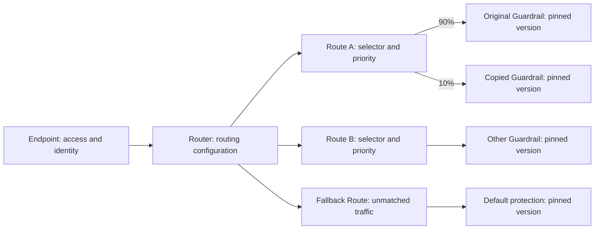

# Router, Route, and Guardrail Weighted Distribution Design

Status: Product design reconciled with the current implementation; deployment acceptance remains separate.  
Reviewed: 2026-09-14. Source baseline: `7b33ef879b73d0d0ffb399235a7910a15baccd62`, with the current workspace checked.  
Scope: Traffic Router object model, editing and publishing, weighted assignment, selectors, Guardrail duplication, monitoring, and management/runtime contracts.

This document distinguishes implemented behavior from product requirements that still need work or deployment evidence. Section 13 records the corrections to the earlier design and the verification performed for this revision. API paths and fields below describe the current source, rather than proposed aliases.

## 1. Design Summary

A Router is a named, independently managed routing configuration that can be edited, published, and monitored. It contains ordered **Routes**. Each Route defines which traffic it matches and how that traffic is distributed across Guardrail targets.

The primary use case is ongoing distribution by application characteristics. For example, requests with `x-channel=partner` can be distributed 70% / 30% between two different Guardrails, while requests with `x-channel=internal` use another distribution. Percentages do not imply a rollout schedule, an experiment end date, or an eventual full switch. Targets do not need to be copies of each other.

Guardrail **Duplicate** creates an independent configuration object. A useful optional workflow is to duplicate a published Guardrail, edit and validate the copy, publish it, assign the original 90% and the copy 10% within one Route, then inspect execution results before adjusting weights.

“Same traffic” means the same matching population: each logical call is assigned to one target. Sending every request to multiple Guardrails would require broadcasting or shadow execution, result selection, and side-effect isolation; those capabilities are outside this design. Duplicating a Guardrail copies configuration, not requests or Runner instances.

The target model remains Router → Route → Target. Legacy storage and protocol fields that still exist are identified explicitly; their presence does not create a supported compatibility or migration contract. Router naming is currently supported at creation; there is no Router rename API or editing control at this baseline.

## 2. Historical Context and Current Model

The original design addressed a model in which an Endpoint grouped condition bindings called Routers, with order and a single Guardrail version attached to each binding. That historical model must not be described as the current public Router model.

| Earlier problem | Current model |
| --- | --- |
| A single conditional binding was called a Router | A Router contains the complete ordered Route configuration |
| Order looked like a separate object or editing destination | The Route array determines matching priority |
| One binding referenced one Guardrail version | Each Route contains a weighted target collection |
| A global Default Router obscured fallback ownership | Each Router explicitly contains one Fallback Route |
| Configuration state obscured actual traffic distribution | Router monitoring separates configuration, assignment counts, and execution outcomes |

The current implementation is centered on [the shared routing model](../controller/shared/traffic-routing.ts), [TrafficRoutingService](../controller/server/services/traffic-routing.ts), [the Router list](../controller/src/routes/routers.tsx), and [Runner routing](../runner/routing.py). The earlier `docs/router-endpoint.md` reference has been removed because that document is no longer present.

Legacy Runner routing and protobuf fields still exist for internal/test paths. An authenticated Endpoint without an executable bound Router does not inherit a global default Router.

## 3. Users and Scope

Administrators configure incoming traffic, selectors, targets, and publication. Operators inspect distribution and protection outcomes. The main workflow is to open a Router, understand the destinations, edit matching conditions and percentages, publish, and compare the observed results.

This design covers Router management, ordered matching, per-call weighted assignment, independent Guardrail copies, publication consistency, and Router / Route / Target monitoring. It excludes automatic weight adjustment, automatic experiment conclusions, request broadcasting, session-level bucketing, and cross-environment copying.

Source inspection and focused tests establish implementation behavior. They do not establish production throughput, monitoring completeness, fault recovery across replicas, or accessibility and layout acceptance on every supported device.

## 4. Object Hierarchy and Terminology



| Object | Meaning and ownership | Configuration |
| --- | --- | --- |
| Endpoint | Protocol, credentials, and incoming traffic identity; bound to at most one Router | Access settings and Router binding |
| Router | Complete routing configuration shared by its source Endpoints | Name at creation, Endpoint set, Route draft, published revisions |
| Route | Conditional distribution entry nested inside a Router | Name, selector, array order, `enabled`, targets |
| Traffic Selector | Boolean selection of request characteristics | Fields, operators, and nested AND / OR groups |
| Distribution | Destinations for traffic received by a Route | Target collection and percentages |
| Target | One destination within a Route | Guardrail, version selection strategy in drafts, resolved version in publications, weight |
| Guardrail | Independently evolving protection configuration | Policy bindings, parameters, execution settings, and associated configuration |
| Guardrail Version | Published execution snapshot | Immutable version identity and compiled artifact |

Route is the domain name used to distinguish routing entries from safety rules inside policies. Some current controls use the label “routing rule”; they still edit a Route. Order is a position, not an object identity.

All bound Endpoints share the Router's ordered Route set. Routes have no public `endpointScope` property. The current selector catalog nevertheless includes `endpoint.id` as a matchable field; the implementation does not restrict it to explanation-only use. Removing that matching capability would be a separate contract change.

The management API can create and publish a Router without Endpoints, and existing Routers can be detached from all sources. Such a Router receives no calls. The current creation sheet requires at least one Endpoint before submission, so API capability and UI behavior differ here.

## 5. Routing and Weight Semantics

### 5.1 Selection Flow

1. Authenticate the Endpoint and resolve its bound, published Router snapshot. Authentication failures are not Router assignments.
2. Extract routing characteristics from the request and its adapter. Use the associated call ID when one is supplied or generated by the adapter.
3. Evaluate enabled Routes in array order. Stop at the first matching Route.
4. If no normal Route matches, select this Router's Fallback Route.
5. Select one positive-weight target within the chosen Route and pin its Guardrail version and plan.
6. While the call context remains valid and accessible, associated Input, Output, and streaming checks reuse that resolution.

A selector chooses the population; the distribution chooses a destination within that population. Overlapping selectors are valid and first-match order determines ownership. Normal Routes need nonempty conditions at publication; only the Fallback is unconditional. Incomplete conditions may exist in a structurally valid saved draft.

A selector simulation can explain that an earlier Route receives a particular sample. This is not a general static proof that all traffic for another selector is shadowed.

### 5.2 Weights and Version Selection

Weights are stored as integer basis points, `weightBps`, where `10000 = 100%`. The editor supports two decimal places. A single target is fixed at 100%; multiple targets must total exactly 100% for publication.

Adding or removing a target explicitly redistributes the remaining collection equally. Remainder basis points go to the first targets: three targets receive `3334 / 3333 / 3333`. Saving and publishing do not silently normalize a manually edited total.

- `0%` retains a target without assigning it new calls.
- Every published Route has at least one target; a total of 100% implies at least one positive weight.
- Duplicate Guardrail/version references within a Route are rejected. Duplicate resolved references are also checked after resolving latest-version strategies.
- Existing Router drafts can retain an invalid percentage total; publication rejects it. The creation sheet and Route sheet use stricter submission checks.
- The schema permits at most 128 Routes, including Fallback, and 32 targets per Route.
- A 90% / 10% configuration expresses an expected proportion across many calls, not an exact nine-to-one quota for every ten requests.

Draft targets support `versionStrategy: "latest" | "pinned"`. Omitting the strategy treats `guardrailVersion` as explicit. In the detail editor, new targets default to **Latest when published**. The separate creation sheet currently uses explicit ready versions.

`latest` means the ready version with an artifact and the highest publication generation for that Guardrail. It does not mean the lexically greatest version label or necessarily the Guardrail's active pointer. Publication preview resolves the strategy; publishing resolves it again. Published snapshots remove `versionStrategy` and contain concrete `guardrailVersion` values. Publishing a new Guardrail version never changes an existing Router revision.

Enabled, positive-weight targets must resolve to ready, non-deleted Guardrails with artifacts. Pinned inactive references can remain in the Controller snapshot without available metadata; `latest` still requires a resolvable ready version even for an inactive target. Runner validation also requires artifacts for positive-weight targets on disabled Routes. A Controller preview therefore does not replace Runner acceptance.

### 5.3 Deterministic Assignment and Call Context

The implemented algorithm is `hmac-sha256-v1`. Runner serializes `[callId, routerRevision, routeId]` as compact JSON, computes HMAC-SHA256 with the distributed assignment key, takes the integer digest modulo 10000, and selects the corresponding interval in target order. If no call ID exists, the newly generated decision ID supplies the hash input.

The desired-state snapshot carries the algorithm, key ID, and key. At this baseline the Controller derives the assignment key from its Runner token and uses key ID `v1`; this is not an independently managed key-rotation lifecycle. The secret hash prevents direct prediction from a chosen call ID, but does not establish an absolute guarantee against adaptive probing or all attempts to influence assignment. Adapters can accept caller-provided IDs; IDs are not universally generated by the server.

The stored resolution includes Router revision, Route and Target IDs, Guardrail/version, the resolved plan, and release/model version metadata. The in-memory store claims a context under a lock; the Redis implementation uses create-if-absent and reads back the winning context. Concurrent requests use that stored winner.

The default context TTL is **300 seconds**. Reuse and completion do not extend it into a fresh post-completion deduplication window. The in-memory store defaults to 10,000 entries and refuses to evict active assignments when full. Cross-Runner consistency requires a shared context store, configured through `GUARD_RUNNER_CALL_CONTEXT_REDIS_URL`, and availability of the pinned execution dependencies.

Associated Output with a call ID but no valid preceding context is rejected with `call_context_expired` under composed routing. It is not reassigned using a new Router revision. Some explicitly supported standalone-output paths may establish a new call; that is not recovery of an expired associated call. Repeated Input after context expiration can establish a new assignment, so uniqueness and deduplication guarantees do not extend indefinitely. Stream sequencing, retries, and delivery guarantees are specified separately in [the gateway integration protocol](gateway-integration.md).

### 5.4 Fallback and Failures

Every Router has exactly one enabled Fallback Route at the end of the array. It has an empty AND selector and, at publication, exactly one target at 100%. It cannot be removed, reordered, disabled, or given conditions. The user explicitly chooses its Guardrail; the editor may then preselect a ready version. It must not silently choose the first Guardrail in the list.

Fallback handles **no normal selector matched**. It does not handle target failures. Once a target is selected, routing does not retry the lottery or move to another Route because execution fails. Normal Guardrail block results remain protection decisions, not routing failures. Policy-specific failure behavior still applies; this design does not turn every dependency failure into the same error response.

An Endpoint without an executable bound Router is rejected with a routing/binding error. It does not enter another Router's Fallback. Failures before Router resolution cannot be counted as assignments to a particular Router; monitoring totals are based on recorded decisions with that Router identity.

### 5.5 Traffic Selector and Routing Input

#### 5.5.1 Selection and Distribution Are Separate

```text
Endpoint input
  → Extract request characteristics and their sources
  → Evaluate Traffic Selectors in Route order
  → First match: distribute all traffic received by that Route
      Guardrail A 70% / Guardrail B 30%
  → No match: use the Fallback distribution
```

For `Header[x-channel] = partner`, all matching traffic reaches that Route; 70% is assigned to A and 30% to B. The remaining 70% does not continue to the next Route. To send 30% to a special Guardrail and the rest to default protection, configure both destinations in the same Route.

Changing percentages does not change the selector. Changing the selector does not inherently replace the target collection.

#### 5.5.2 Fields and Sources

The composed routing model uses [the shared selector catalog](../controller/shared/traffic-routing.ts), [the selector editor](../controller/src/components/traffic-routing/selector-editor.tsx), and [Runner matching](../runner/routing.py). The older Traffic Scope catalog is not the authoritative field list for this model.

| Field group | Current examples | Source and boundary |
| --- | --- | --- |
| Integration identity | `protocol`, `endpoint.id`, `auth.principal` | Endpoint identity comes from the integration; adapter-supplied application identity is not independent end-user authentication |
| HTTP request | `http.method`, `http.host`, `http.path` | Explicit `endpoint_request` or `business_request` source |
| HTTP headers | `http.header` with a custom key | Explicit source; repeated values retained as an array/pair collection |
| Model and adapter | `model`, `litellm.api_key_alias`, `litellm.team_id`, `litellm.user_id`, `a2a.*` catalog entries | Adapter-extracted characteristics available for the initial assignment |
| Output descriptors | `output.sink`, `output.content_type`, `output.schema_id` | Require an explicit first-assignment capability declaration |
| Other characteristics | `tool.name`, `target.environment`, `adapter.field` | Defined key access, not arbitrary expressions; dynamic fields need explicit capabilities |
| Authentication claims | `auth.jwt_claim` with a custom key | Requires an explicit capability and a verified-claim source; catalog presence does not provide JWT verification |

All current selector values have type **string**. The catalog and schemas do not implement the earlier proposal for numeric or Boolean comparison types.

HTTP sources are distinct:

- `endpoint_request`: the HTTP request arriving at Guard.
- `business_request`: original application request metadata explicitly supplied by the adapter. Generic HTTP uses `business_request`; the LiteLLM compatibility path maps payload `request_headers` to this source.

For normalized HTTP sources, method, path, and host use `:method`, `:path`, and `:host`. No implicit fallback or merge occurs between the two sources. User-supplied business headers can support traffic segmentation, but must not be treated as authenticated identity.

`Authorization`, `Cookie`, `Proxy-Authorization`, and `X-API-Key` are rejected as selectable header keys and removed from normalized preview input. Routing samples are not a place to store credentials.

The capability catalog returns `availability`, `availableEndpoints`, source descriptions, cardinality, and availability phase. Explicit Endpoint capability declarations, including an empty list, override adapter defaults. Dynamic `adapter.field`, JWT claims, and output descriptors are unavailable by default without explicit declarations. Capability validation runs for all Routes at publication, including disabled ones. Binding validates the active snapshot if one exists, otherwise the draft; it does not validate both simultaneously.

#### 5.5.3 Deterministic Conditions

| Concern | Current semantics |
| --- | --- |
| Header names | Lowercased on normalization; case-insensitive lookup; nonempty legal names required |
| Values | Case-sensitive by default; `caseSensitive=false` performs ASCII case folding only |
| Whitespace | Runtime HTTP source extraction strips leading/trailing spaces and tabs; internal whitespace remains. Normalized-input simulation expects the adapter-normalized values and does not perform that trimming itself |
| Repeated headers | Values remain separate; no automatic comma splitting |
| Positive operators | Any value may satisfy the condition |
| Negative operators | The field must exist, and every value must fail the corresponding positive comparison |
| Missing versus empty | A present empty string satisfies `exists`; `equals ""` matches actual empty values; an empty value array represents absence |
| Missing field in an available source | Only `not_exists` matches; `not_equals` and `not_in` do not |
| Entire HTTP source unavailable | Every condition on that source is false, including `not_exists`; preview reports `source_unavailable` |
| Unsupported declared capability | Publication or binding validation fails; this differs from a supported field being absent in a request |
| Malformed or oversized routing input | `routing_input_error`; extraction failures must not silently become a partial input that falls through to Fallback |

Operators are `equals`, `not_equals`, `in`, `not_in`, `contains`, `starts_with`, `glob`, `exists`, and `not_exists`. Membership operators take nonempty string arrays, not comma-separated text guessed into a list. Glob matches the complete value, supports `*`, `?`, and backslash escaping, and does not support regular expressions or character classes. `?` consumes one Unicode code point.

Groups support AND and OR, without group-level NOT. The root counts as depth one; the limit is three levels and 16 leaves across the expression. Normal published Routes cannot contain empty groups. Two equality conditions on a multi-value header can be satisfied by different values; they are not automatically contradictory.

Routing input limits are 128 fields per record, 64 values per field, 2,048 characters per value, and a total size budget of 65,536 characters in the defined input records. Keys are bounded to 160 characters. These are extraction/model limits, not service capacity guarantees; cross-language boundary behavior for non-BMP text still requires dedicated parity verification.

#### 5.5.4 Preview and Explanation

The current Selector preview accepts a manually entered normalized JSON sample. It returns normalized input, independent selector results, condition reasons, and ordered ownership. Routes after the winner are `not_evaluated` in order even when their independent match is true. Disabled Routes are `not_applicable`.

Preview does not execute a Guardrail, choose a weighted runtime target, or add traffic statistics. For unbound Routers, the UI labels the input simulated. The simulation API validates input and selector structure; it does not independently prove that the supplied sample could be extracted by the actual bound Endpoint. Publication and binding remain responsible for capability checks.

There is no saved sample library, automatic production-sample selection, or general static shadowing proof in this workflow. The sample lives in the current preview UI state. Additional sample-storage and richer explanation workflows remain product extensions.

## 6. Router Editing and Publication

Router configuration changes first enter a draft. Publishing creates a separate immutable snapshot for new calls. Names are supplied at creation; the current management API does not implement `PATCH /api/v1/routers/:id`. Description is absent from the creation/editing forms, although a `description` API/database field and list rendering remain.

The detail workflow is **Edit routing → Review changes → Publish revision**. Review saves the draft using `expectedDraftRevision`, then calls the read-only publication-preview operation. Saving validates structure; preview and publication add complete selector, percentage, target readiness, and Endpoint capability checks. These are deliberately different validation levels.

The draft revision provides optimistic concurrency control. A stale save or publish returns a conflict. The UI preserves local edits for comparison. Save requests have no publication-style idempotency key; after an uncertain result, reload the Router and reconcile its revision before submitting another mutation.

The review sheet displays resolved target versions and the Endpoint set. The current UI supplies both `reviewedSnapshot` and `reviewedEndpointIds`; publishing compares them with a fresh resolution and returns `router_review_conflict` if they differ. The public API currently permits omission of both fields, so review comparison is conditional, not mandatory for every API caller. Supplying only one is invalid.

Publication and rollback return HTTP **202**, with the publication identity and current Router state. `rolloutStatus` is derived:

| State | Meaning |
| --- | --- |
| `unpublished` | No active Router revision |
| `distributing` | The desired generation has not been acknowledged by all relevant fresh Runners |
| `active` | At least one Runner exists, and all Runners in the default pool have fresh heartbeats and applied the desired generation or later |
| `failed` | A rollout error is recorded and convergence has not been established |

Freshness for this state is 60 seconds. Stale heartbeats can move `active` back to `distributing`; fresh convergence takes precedence over an earlier failure. Controller acceptance is not full deployment success. Runners install complete snapshots, so a transition may temporarily contain different complete revisions across replicas, not half-written target arrays.

Publish and rollback share an idempotency-key namespace per Router. Reusing the same key with the same normalized request returns the original publication identity without redistributing. A different request conflicts. Deleted revision publications retain an audit tombstone and reject replay. Retrying an already recorded failed publication does not force a new rollout; the UI directs the user to publish a new revision.

Endpoint binding changes are independent of Router revision publication. Replacing the normalized Endpoint set with the same set is a no-op. A changed set is committed atomically, audited with before/after source context, advances the desired generation, and is distributed. Publication-time Endpoint context does not change afterward.

Restore in the UI copies historical routing into a local draft and then uses Review / Publish. The direct rollback API also creates a new revision, using historical routing and current bindings. Neither operation restores old Endpoint bindings automatically.

Existing valid calls retain their resolved plan. This remains subject to context lifetime and pinned dependency availability. Router deletion requires detaching its Endpoints. Historical revision deletion requires a non-current revision, Runner convergence, the five-minute retention guard, and no recent unfinished recorded calls. Guardrail reference/deletion checks likewise guard active snapshots and recent calls; they are not a general proof of indefinite artifact retention.

There is no Router pause switch. Access can be disabled at the Endpoint. The Route `enabled` field is enforced by the model and runtime, but the current detail editor no longer exposes an Enabled switch; do not describe it as an available UI control.

## 7. Guardrail Duplicate

### 7.1 Copy Semantics

**Duplicate** creates a new Guardrail draft, with the default name `<original name> - copy`. It is not an alias, inherits no traffic, and creates no Router bindings.

The sheet defaults to the current published version and also offers the current draft. A published copy reads that version's stored `sourceSnapshot`; it never substitutes the current draft. A version without a complete source snapshot returns `source_snapshot_unavailable`, and the user must explicitly choose a draft or publish a new source version. Draft copies require an exact `sourceDraftRevision`; concurrent source changes return `guardrail_draft_conflict`.

| Content | Implemented handling |
| --- | --- |
| `draftConfig` | Copy the selected snapshot, including its configured policy bindings and parameters |
| Runtime and logging settings | Copy `runtimeProfile` and `loggingLevel` |
| Test configuration | Copy `excludedTestCaseIds` and snapshot test cases; preserve case IDs within the new Guardrail so references remain valid |
| Missing/empty snapshot test cases | Regenerate test cases from the copied draft configuration |
| Guardrail identity and creation state | Create a new ID and independent draft state |
| Version history, validation runs, online readiness, logs, statistics, call context | Do not copy |
| Endpoint bindings, Route references, target weights | Do not copy |
| Provenance | Store source Guardrail ID/name, source version or draft revision, copy time, and configuration digest in `copyOrigin` |

The precise copied snapshot contains `draftConfig`, `runtimeProfile`, `loggingLevel`, `excludedTestCaseIds`, and `testCases`. The earlier claim that every execution dependency is frozen by Duplicate was too broad: Duplicate does not snapshot the separate global model configuration or clone external credential values. References already present in the copied configuration retain their meaning; later validation/publication uses the dependencies available then.

Equivalent initial configuration therefore does not establish identical future external-model responses or an identical global execution environment. A copy must complete its own validation/publication and become a ready target before receiving positive-weight traffic.

### 7.2 Lifecycle and Interaction

The Guardrails list's row menu provides the Guardrail Duplicate entry point and opens a side sheet. Router and target editors do not duplicate Guardrail entities. The current Router detail implementation also has no Route Duplicate action; the earlier layout specification described one, but that is not current UI behavior.

The duplicate operation is transactional and uses an idempotency key scoped to the actor. The same key and request return the same copy; reuse with different source/name data returns `duplicate_key_conflict`. The UI freezes the submitted name, source, and key after submission so Retry duplicate can recover the same result after an uncertain response.

A successful copy opens its independent detail workflow through the calling UI. Source edits and later source deletion do not turn the copy into an alias or remove its stored provenance. A failed validation leaves the copy available for correction; it does not roll back the source object.

## 8. Pages and Interaction

### 8.1 Router List and Creation

The list route is `/integration/routers`. Each row represents one Router; its name opens the detail page. Columns show Router, Endpoints, enabled Routes plus Fallback, 24-hour calls, Fallback share, rollout state, and actions.

The current list's enabled Route count comes from the draft; the traffic counts come from runtime assignment aggregation. It must not be interpreted as a count of the currently deployed rules. The list's Fallback calculation uses the active snapshot's Fallback IDs; the detail distribution view also considers historical snapshots. Cross-revision interpretation belongs in the detail view.

Create Router uses a single `xl` side sheet containing name, searchable multi-select Endpoints, normal Route selectors and targets, and unmatched-traffic protection. There is no Description input or multi-step wizard. Occupied Endpoints are disabled and identify the owning Router.

The current UI requires a source Endpoint and valid publication-level structural configuration to submit. The API is less restrictive: it accepts structurally valid incomplete drafts and an empty Endpoint set. Neither creation path publishes the Router. Creation and initial bindings are saved in one transaction, so a binding conflict cannot leave a partially created Router.

Creation has no idempotency-key contract. After a network timeout, inspect the Router list before creating again. Atomicity prevents partial creation, not duplicate Routers after an uncertain successful request.

The fallback section must resolve to one target at 100%. The creation sheet currently reuses the generic target editor without its fallback-specific restriction; an extra target may appear locally, but validation prevents submitting that configuration. The detail Route sheet supplies the fallback restriction directly.

### 8.2 Router Detail

The detail route is `/integration/routers/:routerId`. The fixed tab order is **Overview / Endpoints / Routing / Revisions**, with Overview as default. Revision labels use the immutable creation timestamp in UTC, `YYYYMMDD-HHmmss.SSSZ`; numeric revision IDs remain the API and log identifiers.

| Tab | Current purpose and behavior |
| --- | --- |
| Overview | Read-only traffic topology. All source Endpoints feed the shared ordered rules; target links show configured percentages and pinned published versions. Fallback is separate. Summaries and expandable monitoring provide context |
| Endpoints | Attach/detach source relationships through a side sheet; an Endpoint cannot be owned by another Router. Endpoint links use `/integration/endpoint?endpointId=…` |
| Routing | Read-only published configuration, or the draft if unpublished. Add/edit opens a Route sheet with selector above targets. Confirm applies to the local draft; cancellation leaves no empty Route. Normal Routes can be deleted and reordered using pointer or keyboard drag-and-drop. Fallback is fixed last |
| Revisions | Publication history, publisher, time, configuration differences, publication-time Endpoint context, and exact Guardrail versions. Restore creates a new editable copy and later a new publication; it never mutates history |

The edit workflow uses one Review / Publish sequence. Saving or preview failure preserves the appropriate local/saved draft state. Cancel editing discards local work after confirmation; discard restores the published configuration. The header also exposes Test Router through the advanced Playground.

Revision `context` records Endpoint ID/name/adapter and Guardrail ID/name/version at publication. Missing historical context remains unavailable; current entity names or bindings must not be substituted as historical evidence. The configuration describes possible paths, while runtime logs identify the Route, target, and version actually selected for a call.

The current detail layout supersedes early descriptions of Route Duplicate and an Enabled switch. See [Router detail redesign](router-detail-redesign.md) for layout history; API names in this document and the generated management contract take precedence over older paths in that history.

### 8.3 Monitoring Drill-Down

Expand actual distribution from Overview, then select a Route to see target details: configured share, actual share, assignment count, allow/block/transform/intervene counts, errors among completed calls, inferred timeouts, and end-to-end p95. Target links open call logs filtered by Router, Route, Target, revision, and time range.

Draft percentages must not replace runtime configuration in monitoring. When a window contains multiple Router revisions, display that fact and suppress configured-versus-actual comparison until a single revision is selected. A small sample is not automatically a distribution fault.

Historical traffic remains in the returned rows even if a Route was removed from the active configuration. Names can be resolved from retained revision snapshots or fall back to IDs. Explicit “disabled/deleted” badges for every historical case are a product requirement, not established by the current distribution component.

### 8.4 States and Layout Requirements

| Situation | Required interpretation / current boundary |
| --- | --- |
| No bound Endpoint | No incoming traffic; API editing/publication still possible |
| No normal Routes | All eligible traffic goes to Fallback |
| Configuration load failure | Show failure and retry; do not interpret as an empty Router list |
| Save, publish, or duplicate in progress | Preserve the form and prevent repeated submission |
| Invalid percentages or unavailable active targets | Publication is blocked; structurally valid incomplete drafts may still be saved through the draft API |
| Uncertain mutation result | Reconcile state; use the same idempotency key only for operations with that contract |
| Delayed telemetry | Show that counts may be incomplete; unavailable data is not zero traffic |
| Attempt to delete an in-use resource | Reject with its reference/retention constraints |
| Unsaved edits | Require an explicit decision before discarding them |

The layout should use existing typography, colors, focus treatment, and Sheet/form components. Selector rows must keep labels, operators, HTTP source, key, and values readable. Targets must remain distinguishable without color alone. Narrow layouts use local horizontal scrolling for topology and rule tables, rather than inventing a false one-to-one Endpoint/Route relationship.

The earlier accessibility targets remain: associated input labels, visible focus, keyboard ordering, accessible icon names, and touch targets of at least 44px. This document update does not claim a fresh browser or device-level accessibility acceptance run.

## 9. Router Monitoring Semantics

### 9.1 Unit, Denominators, and Outcomes

The unit is the **first routing decision for a logical call**, represented by `decisionId`. It is not the number of HTTP requests, Input/Output evaluations, streaming chunks, or tokens. Assignment events may be emitted again during associated phases; aggregation deduplicates by `decisionId`.

An adapter path without a reusable associated call ID can produce a new decision per independent evaluation. Expiration or loss of call context also ends the deduplication scope. Monitoring does not provide an unlimited exactly-once identity guarantee across those boundaries.

The default window is 24 hours; the UI offers 15m, 1h, 24h, and 7d. Assignment counts and later completions are grouped by the original decision time.

| Metric | Meaning |
| --- | --- |
| Router total `N` | Recorded decision rows attributed to this Router in the selected window |
| Route count `Mᵢ` | Decisions attributed to this Route after first-match selection; not all samples that independently satisfy its selector |
| Route share | `Mᵢ / N` |
| Target assignments `Aᵢⱼ` | Rows assigned to this target, including calls that subsequently fail during execution |
| Target actual share | `Aᵢⱼ / ΣⱼAᵢⱼ`, within that Route's assigned calls |
| Fallback share | Fallback decision count divided by Router total |
| Unassigned | Rows explicitly marked `assignmentStatus=unassigned`; not hidden inside Fallback or normalized away |
| Execution error rate | `error` or `timeout` outcomes divided by completed calls in the same selected assigned population |
| End-to-end p95 | 95th percentile of recorded completed-call duration from routing decision to completion, including waiting between phases |
| Inferred completions | Calls without a recorded completion after 300 seconds, marked as inferred timeouts by the Controller |

When complete telemetry is available and there are no assignment failures, `ΣMᵢ=N` and `ΣAᵢⱼ=Mᵢ`. With failures, Router totals can include errors before a Route is selected; Route counts can include failures before target assignment. Zero denominators are displayed as `—`.

Outcome precedence is `error/timeout`, then `block`, `intervene`, `transform`, and `allow`. Stage details remain in runtime logs. A terminal block/error can complete a call before Output; telemetry reports Guard's check outcome, not proof that the gateway enforced it. This distinction matters for dry run, where the application may continue after Guard records a block.

The Controller infers a timeout at decision time plus 300 seconds for stale unfinished records. This does not cancel the real model call. A later real completion can replace the inferred result and duration. Completed/assigned counts expose how much of the population has terminal data; they should not be confused with a live upstream execution census.

### 9.2 Collection and Freshness

Runner emits `route_assignment` and `completion` events with stable event IDs derived from `decisionId`, plus call, Endpoint, Router/revision, Route, Target, Guardrail/version, timestamps, status, and outcome metadata. The telemetry exporter persists events in a local write-ahead log before asynchronous delivery. Controller aggregation upserts on `decisionId`, so completion-before-assignment and repeated deliveries can converge on one decision row.

These counts are separate from sampled content logs. A missing content log is not evidence of zero assignments. Conversely, a recent heartbeat is not proof that all events have arrived.

The distribution view polls every 30 seconds. `telemetryFresh` currently requires every Runner in the default pool to have both a recent received-event watermark and a heartbeat less than 60 seconds old. `dataWatermark` is based on the oldest available received-event timestamp; `completeness` is `current` or `delayed_or_unavailable`. An idle Runner can make this signal stale because it has no recent event. `current` is a freshness heuristic, not proof of a lossless complete history or a 60-second delivery SLA.

The service retains assignment records for approximately 30 days, cleaning old records during ingestion, and returns a 15-minute-bucket trend. The maximum distribution query window is seven days. Content-log retention is configured separately. Production capacity, delivery lag, WAL recovery, and cross-replica failure behavior still require deployment verification.

Avoid call IDs, user IDs, and arbitrary selector values as time-series labels. Detailed revision/version attribution belongs in the event-backed query results. Cross-revision actual counts can be inspected together, but comparison with a configured percentage requires the matching revision.

## 10. Current Data and API Contracts

### 10.1 Data Model

| Entity | Current fields / representation |
| --- | --- |
| Router | `id`, `name`, residual `description`, `endpointIds`, `draftRevision`, `draft`, `activeDraftRevision`, `activeRevision`, `activeSnapshot`, `desiredGeneration`, `rolloutStatus` |
| Router draft | `{ routes: [...] }`; order is the array position |
| Router revision | `routerId`, `revision`, `sourceDraftRevision`, immutable `snapshot`, publication `context`, generation, creator, timestamp, publication identity |
| Route | `id`, `name`, `kind`, `enabled`, `selector.expression`, `targets`; nested in the Router, without public `routerId`, `position`, or Endpoint scope |
| Target | `id`, `guardrailId`, `guardrailVersion`, `weightBps`, optional draft `versionStrategy`; nested in the Route, without public `routeId` |
| Selector leaf | `field`, optional `key` and `requestSource`, `operator`, `value`, `caseSensitive`, optional string-only `valueType` |
| Normalized routing input | `endpointId`, `fields`, optional `endpoint_request`, `business_request`, and `extractionErrors` |
| Endpoint binding | Stored as `trafficRouterId`; Router responses expose the inverse `endpointIds` collection |
| Copy provenance | `copyOrigin` with source identity, source version/draft revision, copy time, and content digest |
| Call routing context | Stored resolved plan plus `route_assignment`, messages/content blocks, outcome, completion, and TTL; not a public `CallRoutingContext` CRUD resource |

Route and Target IDs stay stable when editing weights or reordering. New objects get new IDs. The target order is fixed in each published snapshot. Source-copy provenance does not create a cascading ownership relationship with the original Guardrail.

### 10.2 Management API

Paths are relative to the Controller. Authentication is required; mutations and publication preview require administrator access. Read-only simulation is available to authenticated users. Account access tokens are additionally constrained by their resource/action permissions.

| Method and path | Current request / behavior |
| --- | --- |
| `GET /api/v1/routers` | List Routers |
| `POST /api/v1/routers` | `name`, optional `description`, optional `endpointIds`, `draft`; atomically create draft and bindings; HTTP 201; no creation idempotency key |
| `GET /api/v1/routers/:id` | Current Router, draft/publication identity, bindings, and rollout state |
| `PUT /api/v1/routers/:id/draft` | `expectedDraftRevision`, `draft`; save the whole structurally valid draft with concurrency control |
| `POST /api/v1/routers/:id/publication-preview` | `expectedDraftRevision`; read-only resolution to `{ draftRevision, snapshot, endpointIds }` |
| `POST /api/v1/routers/:id/publish` | `expectedDraftRevision`, `idempotencyKey`, optional paired `reviewedSnapshot` and `reviewedEndpointIds`; HTTP 202 |
| `GET /api/v1/routers/:id/revisions` | List immutable revisions |
| `GET /api/v1/routers/:id/revisions/:revision` | Read one revision |
| `DELETE /api/v1/routers/:id/revisions/:revision` | Delete eligible historical revision; current/in-use/retained revisions are rejected |
| `POST /api/v1/routers/:id/rollback` | `expectedDraftRevision`, historical `revision`, `idempotencyKey`; publish historical routing as a new revision; HTTP 202 |
| `PUT /api/v1/routers/:id/endpoints` | `endpointIds`; atomically replace sources after ownership/capability validation; identical normalized sets are no-ops |
| `DELETE /api/v1/routers/:id` | Delete an unbound Router; HTTP 204 |
| `GET /api/v1/routing/selector-fields` | Optional comma-separated `endpointIds` query; field catalog and Endpoint capabilities |
| `POST /api/v1/routers/:id/simulations` | `draft`, normalized `input`; return ordered/independent selector explanations and normalized input; no execution or traffic counts |
| `GET /api/v1/routers/:id/traffic-distribution` | `hours` from 0.25 to 168, default 24; optional positive numeric `revision` and `endpointId` |
| `GET /api/v1/routers/:id/routes/:routeId/traffic-distribution` | Same filters; only `rows` is restricted to the Route; report totals, trend, and other metadata remain Router-wide |
| `POST /api/v1/guardrails/:id/duplicate` | `name`, `idempotencyKey`, and one of `sourceVersion` / `sourceDraftRevision`; omitting both source fields defaults to the active version; HTTP 201 |

There is no Router `PATCH` operation. The earlier `/traffic-selector-fields`, `/selector-preview`, `/distribution`, and Router `/preview` paths are not aliases for these operations. The actual contracts are defined in [HTTP route registration](../controller/server/http/app.ts) and [the generated OpenAPI document](../controller/openapi/controller.openapi.json).

The whole-draft API prevents intermediate condition/target writes. Controller desired state includes complete Router snapshots, targets, assignment keys, and Endpoint bindings. Runner owns runtime matching, assignment, context pinning, and telemetry emission. The management UI is not in the routing execution path.

Audits record draft updates, publication/rollback snapshots, Endpoint changes, deletion, and copy provenance. Old/new weights and ordering can be reconstructed from recorded snapshots; there is not a separate audit event type for every individual field edit.

## 11. End-to-End Scenarios

### 11.1 Ongoing Distribution by Business Headers

A shared Router receives two Endpoints that support original business-request metadata. A, B, and C may be unrelated Guardrails.

| Order | Traffic Selector | Distribution |
| --- | --- | --- |
| 01 Partner channel | `business_request` header `x-channel equals partner` AND `x-region in [cn, sg]` | A 70%, B 30% |
| 02 Internal traffic | `business_request` header `x-channel equals internal` | B 40%, C 60% |
| Fallback | No preceding match | Default Guardrail 100% |

`partner + cn` selects only between A and B. `internal` selects between B and C. `partner + us` reaches Fallback. Missing fields follow the Boolean rules; an absent HTTP source makes its conditions false, while malformed extraction raises an error.

If the Router records 10,000 calls and Route 01 receives 2,000, the Route's Router share is 20%. B's expected assignments from Route 01 are 600. B's assignments from Route 02 have a different denominator and must not be mixed into Route 01's 30%.

### 11.2 A Copy as an Optional Target

1. A support Route initially sends 100% to Guardrail A v3.
2. Duplicate A v3 into an independent B draft. A and its traffic remain unchanged.
3. Edit B, validate and publish it, and wait until B v1 is ready.
4. Edit the original Route to A v3 90% and B v1 10%.
5. Review the resolved targets, changes, and source Endpoints, then publish Router r13.
6. New calls use the complete revision installed on the receiving Runner. Existing valid associated calls retain their assigned target.
7. Inspect Route share first, then target shares, protection outcomes, and execution errors.
8. To stop new assignments to B, publish r14 with A 100% and B 0%. Existing calls remain subject to their pinned context and dependencies.

If the Route receives 20% of Router traffic, B's expected share of all Router traffic is `20% × 10% = 2%`. Its 10% Route share must not be labeled a 10% Router share.

## 12. Acceptance Criteria

These criteria describe the behavior to verify, not a blanket statement that every deployment and UI path has passed.

| Scenario | Observable acceptance result |
| --- | --- |
| Header name casing differs | `X-Channel` and `x-channel` address the same field; value casing follows `caseSensitive` |
| The same header differs between HTTP sources | Only the explicitly selected source is matched |
| Missing field, empty string, repeated values, absent source | Distinct outcomes follow Section 5.5; absent source does not satisfy `not_exists` |
| Endpoint lacks a selector capability | Publication/binding fails with the Endpoint and condition identified |
| A field becomes available only after Output | It cannot be used for first-assignment selection without an explicit capability that makes it available earlier |
| Preview independently matches a later Route | The earlier winner receives the sample; later online state is `not_evaluated` |
| A Route assigns B 30% | The other 70% goes to targets in that same Route, not to the next Route |
| Multiple normal selectors match | Only the first enabled matching Route owns the decision |
| No normal selector matches | Only this Router's Fallback is selected |
| Weights total 99% or 101% | Structurally valid draft storage is possible; publication fails |
| A target has 0% | It receives no new assignments; deterministic test IDs exercise target intervals |
| Draft uses latest, then a new ready version appears after review | Reviewed publication conflicts if the freshly resolved snapshot changed |
| Concurrent Input/Output reaches different Runners | A shared valid context selects one winning resolution; no reassignment on associated Output |
| Weights change during streaming | The existing call keeps its resolution while context/dependencies remain valid; new calls use the installed revision |
| Selected execution fails | No new lottery or Fallback execution; assignment and execution failure are distinguishable |
| A published version is duplicated after its draft changes | The copy comes from the selected source snapshot |
| Duplicate request is replayed | Same actor/key/request returns the same copy; changed content conflicts |
| Router creation response is lost | No idempotency guarantee is assumed; state is reconciled before recreating |
| Multi-stage/repeated assignment events arrive | One aggregation row per retained decision ID |
| Completion is late or arrives first | It remains attributed to the original decision time; a real completion can replace an inferred timeout |
| Telemetry is stale or the window spans revisions | Show stale/multiple-revision status; do not substitute zero or current draft weights |
| Rollout partially fails or an edit is stale | Report real rollout state; reject stale mutations without silently overwriting edits |
| Read-only users, keyboard input, narrow viewport | Server permissions hold; applicable controls remain usable and edits are not lost |

Delivery remains organized around four complete areas: routing/assignment, Guardrail copy lifecycle, Router publication/binding, and monitoring/drill-down. Monitoring is part of the product scope. Open items and deployment checks below must not be hidden by marking the entire design complete.

## 13. Calibration Record and Evidence

### 13.1 Corrections to the Earlier Specification

| Topic | Calibrated statement |
| --- | --- |
| Target versions | Drafts may use latest-at-publication; runtime snapshots contain pinned versions only |
| Router name | Set at creation; rename API/UI is absent |
| API paths | Use `publication-preview`, `simulations`, `/routing/selector-fields`, and `traffic-distribution` |
| Route shape | Array order replaces a public `position`; nested objects do not expose the proposed `routerId`/`routeId` fields |
| Endpoint scope | No public Route `endpointScope`; `endpoint.id` remains selectable, and legacy protobuf scope fields remain |
| Unbound Router | API creation/publication is allowed; the creation sheet requires a source |
| Draft validation | Save allows incomplete publish-time configuration; preview/publish apply stronger checks |
| UI operations | Current detail supports add/edit/delete/order; it has neither Route Duplicate nor an Enabled switch |
| Selector types | String-only operators; numeric/Boolean comparisons are not implemented |
| Missing HTTP source | Distinct from a missing header, including for `not_exists` |
| Call identity and lifetime | Caller IDs can be used; default TTL is 300 seconds; no fresh post-completion deduplication window |
| Duplicate dependencies | Copies the recorded configuration/test snapshot; does not freeze separate global model configuration or duplicate credentials |
| Review enforcement | UI sends reviewed snapshot and Endpoint set; API comparison is conditional on receiving them |
| Publication success | HTTP 202 and publication identity; Runner convergence is a separate derived state |
| Route-level distribution API | Filters rows only; aggregate totals/trend remain Router-wide |
| Telemetry completeness | Freshness heuristic and recorded decision counts, not an end-to-end losslessness guarantee |
| Historical links | Removed deleted Endpoint-design reference and updated the Router detail link to its English filename |

### 13.2 Source Index

| Area | Source |
| --- | --- |
| Schemas, limits, capabilities, preview semantics | [traffic-routing.ts](../controller/shared/traffic-routing.ts) |
| Transactions, latest resolution, idempotency, bindings, aggregation | [TrafficRoutingService](../controller/server/services/traffic-routing.ts) |
| API registration and status codes | [app.ts](../controller/server/http/app.ts) |
| Derived rollout states | [router-lifecycle.ts](../controller/shared/router-lifecycle.ts) |
| Source snapshots and Duplicate | [control-plane.ts](../controller/server/services/control-plane.ts), [Duplicate sheet](../controller/src/components/guardrail-duplicate.tsx) |
| Runner matching and HMAC assignment | [routing.py](../runner/routing.py) |
| Snapshot validation and target resolution | [artifact_store.py](../runner/artifact_store.py) |
| Associated call resolution and outcomes | [runtime service](../runner/toolkit/runtime/service.py) |
| In-memory and Redis context storage | [context.py](../runner/toolkit/runtime/context.py), [call_context.py](../runner/call_context.py) |
| Telemetry persistence and delivery | [telemetry.py](../runner/telemetry.py) |
| Router detail and creation | [router-detail.tsx](../controller/src/routes/router-detail.tsx), [create-router-sheet.tsx](../controller/src/components/traffic-routing/create-router-sheet.tsx) |
| Distribution UI and denominators | [distribution.tsx](../controller/src/components/traffic-routing/distribution.tsx) |

### 13.3 Verification Performed on 2026-09-14

| Check | Result and boundary |
| --- | --- |
| Shared selector/routing and Router lifecycle tests; target distribution/editor, routing changes, and revision component tests | 55 tests passed across five files |
| Runner composed routing and adapter selector dispatch tests | 37 passed, one skipped; one dependency deprecation warning |
| Redis shared-context integration test | Skipped because `GUARD_TEST_REDIS_URL` was not configured; no live multi-Runner Redis acceptance claimed |
| PostgreSQL transaction integration suite | Source inspected; not run for this documentation change |
| Browser layout/accessibility and deployment rollout/telemetry | Not rerun; source-level observations are not fresh visual or production acceptance |

The focused tests are [shared routing](../controller/shared/traffic-routing.test.ts), [Router lifecycle](../controller/shared/router-lifecycle.test.ts), [selector editor](../controller/src/components/traffic-routing/selector-editor.test.ts), [routing changes](../controller/src/components/traffic-routing/routing-changes.test.tsx), [Router revisions](../controller/src/components/traffic-routing/router-revisions.test.tsx), [composed routing](../tests/data_plane/test_composed_routing.py), and [adapter selector dispatch](../tests/data_plane/test_adapter_selector_dispatch.py). Database behavior has a separate [PostgreSQL integration suite](../controller/server/services/traffic-routing.postgres.test.ts).

### 13.4 Remaining Product and Deployment Work

- Decide whether Router renaming, Route duplication, a Route enable/disable control, and saved selector samples should be exposed in the current UI. They are not supplied by documenting the earlier design.
- Align creation/detail behavior for unbound Routers, latest-version selection, and fallback target editing where a uniform experience is required.
- Complete any desired physical cleanup of `description` and legacy protobuf Route scope fields. Decide separately whether `endpoint.id` remains a supported selection characteristic.
- Verify capability declarations and input parity for every deployed adapter, including normalization and non-BMP length boundaries; preview alone does not certify extraction.
- Verify Redis-backed concurrent assignment, context expiration, dependency retention, and recovery across real Runners and failures.
- Verify publication rejection/recovery and the stronger Runner artifact checks, including positive-weight targets on disabled Routes.
- Validate telemetry retention, late delivery, WAL recovery, idle-runner freshness, and production lag against an explicit service objective.
- Verify Duplicate configuration completeness for the dependencies the deployment actually uses; do not infer a frozen global model environment from configuration equality.
- Keep Router creation atomicity separate from idempotency. A creation retry contract remains unimplemented.

These are explicit boundaries of the calibrated design. They do not require changing implementation as part of this documentation update.
