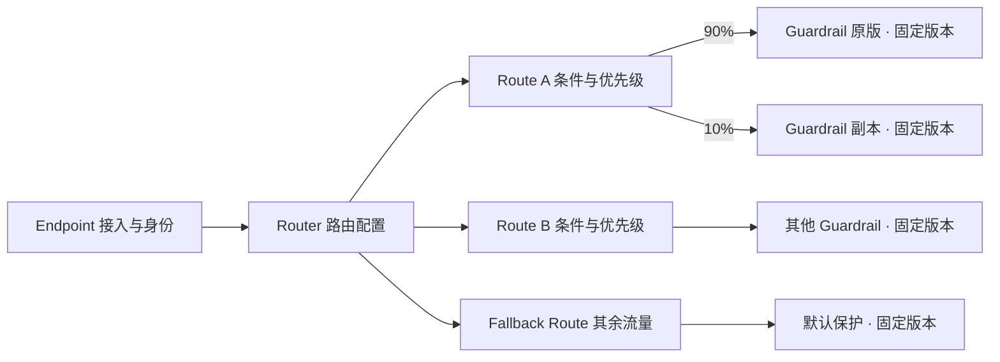

# Router、Route 与 Guardrail 加权分发设计

状态：产品行为 Spec；按用户历次修订校准，实现验收逐项记录  
日期：2026-09-11  
范围：Traffic Routers 对象模型、编辑体验、分发监控、Guardrail Duplicate、运行时及管理契约

## 1. 设计结论

Router 是可独立命名、编辑、发布和监控的流量路由对象。Router 内部包含有序的 **Route（路由条目）**：每条 Route 定义哪些流量符合条件，以及这些流量如何按权重分配给多个 Guardrail 目标。

**主要场景是按业务特征持续分发流量**：例如某 HTTP Header 的值为 partner 时，按 70%/30% 分给两个不同的 Guardrail；另一个 Header 值为 internal 时，使用另一套分配。比例没有必须逐步放量、最终切换或实验结束的含义，目标也不必是副本关系。

Guardrail 支持 **Duplicate（创建副本）**。副本具有独立身份和相同的配置起点，随后可以独立编辑、发布、接收流量及统计。其中一种可选路径是：复制线上 Guardrail → 修改并验证副本 → 在同一 Route 内配置原版 90%、副本 10% → 观察分发和执行结果 → 调整权重。

本设计直接定义目标模型，不提供旧模型兼容、旧 API 别名或数据迁移方案，也不以业界做法作为决策依据。现有源码和用户截图仅用于识别问题，不能覆盖本次用户需求。

**关键解释假设：**“同一份流量”解释为同一匹配流量集合，每次逻辑调用只进入一个 Guardrail。若需要把每个请求同时复制给多个 Guardrail，则属于广播或影子执行，涉及结果选择与副作用隔离，不包含在本提案中。Guardrail Duplicate 是配置对象复制，不是请求复制，也不是增加 Runner 实例。

## 2. 初始实现与问题来源（历史背景）

最初审查时，本地页面与截图一致：外层标题是 Endpoint，内层带 Order 的行被称为 Router，点击行进入 Router 详情。源码进一步确认当前 Router 同时持有 endpointId、routeOrder、trafficScope 和单个 guardrailId/guardrailVersion。

| 现状 | 用户影响 | 新设计 |
| --- | --- | --- |
| Endpoint 分组下的单条条件绑定叫 Router | 找不到“整套路由配置”的编辑入口 | Router 成为一级实体，条目叫 Route |
| Order 附着在 Router 行上 | 排序对象与编辑对象混淆 | Order 只表示 Router 内 Route 的匹配顺序 |
| 一条记录直接绑定一个 Guardrail Version | 无法表达同一条件下的加权目标 | Route 下有 Target 集合 |
| Default Router 在普通列表外单独出现 | 全局与内部兜底关系不直观 | 每个 Router 显式包含一条 Fallback Route |
| 页面侧重配置和 Protected 状态 | 看不到各条目实际分走多少流量 | Router 详情提供总览与 Route 分布 |

取证入口：`controller/src/routes/routers.tsx`、`controller/src/lib/routers-api.ts`、`controller/src/lib/controller-api.ts`、`controller/server/domain/router-routing.test.ts`、`docs/router-endpoint.md`。后者描述当前实现，不是新设计约束。

## 3. 使用者与边界

主要使用者是配置接入流量的管理员，以及观察分发与保护结果的运维人员。首要任务是打开一个 Router，理解流量去向，编辑匹配条件和目标比例，发布后核对实际结果。

本期覆盖 Router 管理、Route 匹配与排序、按调用加权分流、Guardrail 副本、发布一致性和最低可用监控。不包含自动调权、自动实验结论、请求广播、会话级分桶或跨环境复制。

## 4. 对象层级与命名



| 对象 | 含义与归属 | 可编辑内容 |
| --- | --- | --- |
| Endpoint | 接入协议、鉴权、流量身份；作为一个 Router 的来源 | 接入信息与 Router 绑定 |
| Router | 一个或多个来源 Endpoint 的完整路由配置 | 名称、来源 Endpoint 集合、Route 集合、发布版本 |
| Route | Router 内部的条件分发条目，不能脱离 Router 存在 | 名称、条件、顺序、启停、Targets |
| Traffic Selector | Route 内定义要选取的请求特征；输出匹配或不匹配 | 字段来源、条件及 AND/OR 组合 |
| Distribution | Route 内定义匹配流量的去向 | Target 集合与各目标比例 |
| Target | Route 内的一个目标 | Guardrail、固定版本、权重 |
| Guardrail | 可独立演进的保护配置 | 策略绑定、参数、执行行为等 |
| Guardrail Version | Guardrail 的不可变执行快照 | 发布后不可变 |

选择 Route 而不是 Rule，是为了与 Guardrail/Policy 内部安全规则区分；界面显示“路由条目”，英文为 Route。Order 只是一列“优先级”，不是对象名称或详情入口。

一个 Router 可以绑定一个或多个来源 Endpoint。Route 不再拥有 Endpoint 范围，也不负责判断请求来自哪个 Endpoint；它统一处理 Router 来源 Endpoint 集合中的输入流量。没有绑定来源 Endpoint 的 Router 可以编辑和发布，但不能接收运行时调用。一个 Endpoint 最多绑定一个 Router。

## 5. 路由与权重语义

### 5.1 选择流程

1. 校验 Endpoint 身份，找到其已绑定的 Router 发布快照。鉴权失败不进入 Router 分发统计。
2. 建立逻辑调用标识，由 Endpoint 适配器生成并冻结 Routing Input，明确请求特征的来源和可用性。
3. 按 Route 优先级依次执行 Traffic Selector，跳过停用条目；命中第一条后停止匹配。
4. 未命中普通 Route 时，进入这个 Router 的 Fallback Route。
5. 在选中 Route 的正权重 Targets 中选出一个目标，固定 Guardrail 及其版本。
6. 同一调用的输入、输出、流式分片与内部重试复用这次分配，不再次匹配或抽签。

Traffic Selector 的字段、HTTP Header 和布尔语义见第 5.4 节。Selector 只判断请求特征，Distribution 才执行比例分配。

普通 Route 必须包含有效条件。无条件匹配只允许存在于 Fallback Route，避免它提前截获所有流量。重叠条件合法，顺序决定归属；编辑时显示“首条命中”，能确定完全遮蔽时提示，不宣称可以静态证明所有条件的覆盖关系。

### 5.2 权重定义

首版将权重直接表示为百分比，界面支持两位小数，存储为整数基点（10000 = 100%）。单目标固定 100%，不提供比例编辑；多目标之和必须恰好为 100%。新增或删除目标时，UI 为当前目标集合重新等分百分比（整数基点合计精确为 100%）；这是显式增删操作的初始值，不是保存或发布时自动归一化。用户随后可修改多目标百分比。已有 Router 编辑中的草稿可以暂时不满足，发布时必须满足；创建表单要求有效条件、固定目标版本和 100% 的分配总和。

- 权重 0% 表示保留该目标但不分配新调用。
- 每条 Route 至少一个目标且至少一个正权重目标。
- 同一 Route 不允许重复的 Guardrail ID + Version；不同 Guardrail 副本即使内容相同也属于不同目标。
- 每个 Target 必须指定不可变版本，不能用动态 latest。新 Guardrail 版本发布不会悄悄改变 Router。
- 90%/10% 是大量独立调用的期望比例，不保证每十个请求恰好九个和一个。

分配可实现为：对服务端建立的调用 ID、Router revision、Route ID 使用服务端密钥执行稳定哈希，映射到 [0,10000)，按发布快照中的 Target 顺序落入权重区间。算法版本与密钥版本纳入运行快照；调用者不能通过自行选择调用 ID 操纵目标。新调用独立分配，不承诺同一用户跨调用固定目标。

分配上下文记录 routerRevision、routeId、targetId、guardrailId、guardrailVersion；多 Runner 共享，原子创建。同一有效调用标识在上下文保留期内重复进入只复用已有分配。上下文 TTL 必须覆盖最大调用时长及允许重试时长；结束后保留去重窗口。过期关联输出返回明确错误，不在新配置下重抽。只有独立输出的适配器，将首次输出作为新逻辑调用入口。

### 5.3 Fallback 与异常

每个 Router 有且仅有一条 Fallback Route，固定末尾，不可停用、删除或配置条件，但可以编辑名字与加权目标。创建时由用户显式选择默认 Guardrail；选定后可预选其就绪版本，所选固定版本必须在表单中可见。不得自动选择列表中的第一个 Guardrail。

Fallback 仅处理“没有普通条目命中”，不处理“目标执行失败”。命中目标不可用或执行错误时，返回明确的保护不可用错误并计入执行失败；不偷偷转去其他 Route、不重新抽签、不自动放行。Guardrail 自身的 block 是正常保护结果，不是运行错误。

删除当前部署中的全局 Default Router 特殊实体；默认保护在每个 Router 的 Fallback 中显式表达。Endpoint 缺少 Router 或没有可执行快照时拒绝评估，计入接入/绑定错误，不假装进入某个 Router 的 Fallback。平台如需共用默认策略，可以创建普通 Router 并绑定多个 Endpoint。

### 5.4 Traffic Selector：从 Endpoint 输入挑选流量

#### 5.4.1 两个独立问题

每条 Route 的固定结构是 **Traffic Selector（选择哪些流量）+ Distribution（将选中流量分给谁）**。Selector 返回布尔值，不包含百分比；Distribution 的分母是当前 Route 实际接住的流量。修改比例不修改 Selector，修改 Selector 也不重置 Targets。

```text
Endpoint 输入
  → 提取 Routing Input（请求特征及来源）
  → 按 Route 顺序检查 Traffic Selector
  → 首条命中：对这一批流量执行 Distribution
      Guardrail A 70% / Guardrail B 30%
  → 全部未命中：Fallback 的 Distribution
```

例如 `Header[x-channel] = partner` 命中的所有流量都进入这条 Route，其中 30% 去 B、70% 去 A。不能把它解释为“仅挑中 30%，剩下 70% 继续检查下一条 Route”。如果只想处理其中 30%，其余去默认保护，应在同一 Distribution 中显式配置“指定 Guardrail 30% + 默认 Guardrail 固定版本 70%”。

#### 5.4.2 从现有 Traffic Scope 演进

现有实现已经具备 `http.header` 自定义 Key、AND/OR 嵌套、equals/contains/starts_with/glob，并提供 HTTP 方法/路径/Host、模型、认证身份、JWT Claim、LiteLLM、A2A 和 adapter.field 等字段目录。前端见 `controller/src/components/traffic-scope/`，目录定义见 `controller/server/http/app.ts` 的 `trafficScopeFields`，运行匹配见 `runner/artifact_store.py`。

沿用条件构建器的交互基础，产品统一叫 Traffic Selector；它移入 Route，不丢弃已有字段类别。目录中出现的字段不代表每个 Endpoint 都能在首次路由时提供：新设计增加按 Endpoint、适配器和可用阶段描述能力的契约，不能只展示一份全局字段列表。

#### 5.4.3 Routing Input 与字段来源

| 字段组 | 例子 | 来源与使用边界 |
| --- | --- | --- |
| 接入身份 | Endpoint ID、已认证主体 | 系统产生，不允许业务 Header 覆盖 |
| HTTP 请求 | method、host、path | 明确标注业务请求或接入调用；不隐式混合来源 |
| HTTP Header | x-channel、x-region、x-business-line | 自定义 Header 名，选择具体来源 |
| 模型与适配器字段 | model、LiteLLM team_id、A2A operation | 适配器提取并声明类型、来源、可用阶段 |
| 请求属性 | 注册的业务标签、adapter.field | 采用定义好的键访问规则，不执行任意表达式 |
| 认证 Claim | 已验证的 JWT Claim | 只读取验证后的 Claim；原始未验证 Token 不当作身份 |

HTTP 字段明确区分两种来源：

- **Endpoint 接入请求**（`endpoint_request`）：发送到 Guard 服务的这次 HTTP 请求。
- **原始业务请求**（`business_request`）：网关/SDK 适配器明确携带的原始请求信息。界面列出哪些 Endpoint 支持、如何传入；没有传入就没有该来源。

当前 HTTP 适配路径读取实际请求头，LiteLLM 路径读取 payload.request_headers；新设计要求为它们标记来源，不能让同一个无来源的 Header 条件在两个 Endpoint 上指代不同层。若 Endpoint 接入请求本身就是业务请求，由适配契约显式声明这一映射。method/path/host 同样遵守来源约定，不默默回退到另一层。

自报业务 Header 可以作为业务分流特征，但不成为认证身份。Authorization、Cookie、Proxy-Authorization、X-API-Key 等凭据头不进入可选字段与样本记录；使用已有的认证主体或脱敏身份字段表达相应分流需求。

Routing Input 只包含首次分配时可获得的数据。output.sink 等输出描述若预先给出可以参与；只有输出产生后才知道的字段不能用于已开始调用的 Selector。后续阶段复用已有分配，不因为新增 Header 或输出属性重新选 Route。

#### 5.4.4 Header 与条件的确定性语义

| 项目 | 设计定义 |
| --- | --- |
| Header 名 | 保存时转小写，校验非空和合法字符；匹配不区分大小写 |
| Header 值 | 默认区分大小写；字符串字段可显式选择忽略大小写，首版限定 ASCII 大小写折叠 |
| 空白 | 仅按适配器契约移除 HTTP 值边缘的空格/Tab；保留内部空白，不对所有字段值统一 trim |
| 多值 Header | 保存为值数组；不擅自按逗号拆分；适配器声明是否已合并及是否支持保留重复值 |
| 重复 Header 匹配 | 正向操作任一值满足即匹配；负向操作要求字段存在且所有值均不满足对应正向操作 |
| 缺失与空串 | 分开表达；exists 对存在但空串为真；equals 空串只匹配实际空值 |
| 缺失字段比较 | 除 not_exists 外均为 false，not_equals 也不能把缺失当匹配 |
| 不支持来源 | 发布时依据所绑定 Endpoint 的能力报错；不能当成正常的缺失 Header |
| 运行时提取失败 | 如畸形输入或超出提取上限，报 routing_input_error，不静默丢 Header 后走 Fallback |

字符串操作支持 equals、not_equals、in、not_in、contains、starts_with、glob、exists、not_exists。in/not_in 的值由多值输入控件表达，不能通过逗号文本猜测。glob 首版只定义 `*`（任意长度）、`?`（单字符）及转义，匹配整个值，不提供正则表达式。数值和布尔字段按字段目录提供类型适配的比较，不把 Header 字符串自动转成数值。

组支持“全部满足 AND”“任一满足 OR”，首版不引入整组 NOT。根组计为第一层，最多三层、共 16 个叶子条件；前端、管理 API、快照编译统一校验。非 Fallback 不允许空组。多值 Header 的两个 equals 可以分别由不同值满足，不能复用现有“不同 equals 必冲突”的单值判断；单值字段的明确矛盾仍可定位提示。

Selector 不再包含 Endpoint 范围条件。Route 的输入天然来自 Router 顶部指定的来源 Endpoint 集合；绑定或更换来源 Endpoint 集合时，重新执行所有 Route 的能力校验，失败则阻止绑定。一个已被其他 Router 占用的 Endpoint 不能加入当前 Router。

#### 5.4.5 选择器预览与解释

编辑器提供“测试 Selector”，输入或选择一个脱敏请求样本，展示规范化后的字段来源、每个条件的结果及失败原因：值不等、字段缺失、来源不支持。测试是纯匹配，不调用 Guardrail，也不影响线上统计。

同时提供“放入 Router 顺序检查”：分别显示“此 Selector 独立匹配”和“按当前顺序是否由此 Route 接住”。如果前面的 Route 已匹配，显示“被 Route X 优先接收”；后续条目的线上状态应是“未评估”，不能误报“不匹配”。抽样样本只解释该样本，不宣称代表全量覆盖率。

草稿未绑定 Endpoint 时可用手工指定适配器能力的样本预览，但结果标为“模拟输入”；发布和绑定时仍做实际能力校验。样本内 Header 值默认不持久化，保存样本需显式操作，凭据字段剔除。

## 6. Router 的编辑与发布

Router 保存草稿和不可变发布 revision。新增、修改、排序、启停 Route、调整目标权重均先进入草稿，点击“发布配置”才影响新调用。名称作为管理元数据保存；Router 创建及编辑不提供 Description 输入；历史快照保留当时名称用于解释日志。

发布检查条件结构、Fallback 唯一性、权重总和、目标引用与就绪状态、Endpoint 适配能力，并展示前后变化及影响范围。使用草稿版本号进行乐观并发控制；有冲突时保留本地编辑，要求重新加载比较，不能覆盖他人修改。

发布状态为“未发布 → 分发中 → 已生效 / 分发失败”。控制面事务生成完整快照；Runner 原子安装完整快照，不能读取半套 Targets。首版允许 Runner 短时间处于新旧完整 revision，展示部署进度，所有统计保留实际 revision；分发失败时已有 Runner 继续使用其最后可用完整快照，管理页显示不一致，支持重试或将旧内容发布为新 revision。不能把“控制面已保存”显示为“全量生效”。

旧调用继续使用既有 Guardrail 版本，旧制品至少保留至相关调用完成或超时。删除 Router 必须先解除 Endpoint 绑定；被有效快照、未结束调用引用的 Guardrail 版本不能物理删除。

首版不提供含糊的 Router 暂停开关。暂停接入由 Endpoint 承担；停用单条 Route 则重新发布，后续调用继续检查下一条或 Fallback。

## 7. Guardrail Duplicate

### 7.1 复制语义

操作名使用 **Duplicate / 创建副本**，结果是新的 Guardrail 对象，默认名称“原名称 - 副本”，用户可修改。它不是原对象别名，不自动绑定任何 Router，也不继承原对象流量。

复制弹窗显式选择来源：默认“当前已发布版本”；也允许“当前草稿”。来源冻结为 sourceVersion 或 sourceDraftRevision，复制过程中源对象继续编辑不会改变这次复制结果。

| 内容 | 处理方式 |
| --- | --- |
| 策略版本绑定、参数、规则启停与顺序、动作覆盖 | 按来源完整复制 |
| Rail 配置、执行配置、模型配置引用、输出交付方式 | 按来源完整复制；执行依赖必须固定 revision |
| 测试选择、排除项、预期覆盖、日志配置 | 复制对应配置，保留参数语义 |
| ID、创建时间、发布版本身份 | 新建 |
| 旧版本历史、运行日志、统计、调用上下文 | 不复制 |
| 原验证运行记录、在线状态、就绪状态 | 不作为副本的新验证或就绪证据 |
| Endpoint 绑定、Route 引用、流量权重 | 不复制 |
| 来源信息 | 保存源 Guardrail、源 revision/version、复制时间与内容摘要 |

“一模一样”定义为创建时配置与固定依赖一致。副本拥有独立可修改配置，允许共享不可变 Policy Version 或不可变制品内容；不共享可变配置引用。外部凭据引用保持相同，不复制明文密钥，不承诺外部模型服务永远给出相同结果。

复制已发布版本时，从该版本保存的完整源配置快照创建，不能用当前草稿替代。若某配置目前只存在于对象层，新版本模型需将其纳入可复制快照，避免声明“完整复制”却漏掉模型或测试设置。

### 7.2 生命周期与交互

副本创建后进入独立草稿，跳转副本详情，展示“复制自 X · vN”。下一步可以直接验证并发布，也可以先编辑。副本完成自身发布和 Runner 就绪后，才可作为正权重线上目标。

创建接口使用幂等键；重复提交返回同一副本。复制失败不得留下看似成功的半份配置。保存成功但验证失败时保留完整副本草稿并提供重试，不回滚源对象。

Guardrails 列表每行最右侧的省略号菜单提供唯一的 Duplicate 入口，选择后打开右侧副本创建面板；详情页不提供 Duplicate 按钮。Duplicate 只是 Guardrail 创建的便捷操作，Router、Route、Target 编辑器均不提供复制入口，也不依赖副本关系。来源删除后仍保留复制时的来源名称和 ID 文本。

## 8. 页面与交互设计

### 8.1 Router 列表 `/integration/routers`

列表每行代表一个 Router，名称是详情入口。列为：Router 名称、来源 Endpoints、启用 Route 数（另标 1 条 Fallback）、近 24h 调用量、Fallback 占比、发布状态、更多操作。侧栏数字统计 Router 实体数。

首屏主操作是“创建 Router”。单页面依次平铺名称、来源 Endpoint、Route settings、其余流量的默认去向，不拆分步骤、不填写 Description。来源 Endpoint 使用可输入名称搜索的多选下拉；已选来源以可移除标签显示；其他 Router 已占用的来源禁用并说明归属。每条 Route 先展示表达式构建器，再展示一个或多个 Guardrail 与百分比；可在同页新增或删除普通 Route。提交时 Router 草稿和来源绑定必须在同一事务中保存，冲突完整回滚，不能先创建成功再绑定失败。创建成功后仍需发布才有可执行快照。详情可继续修改或解除来源绑定，包括尚未发布的 Router。接入是否 Verified 放在 Endpoint 处，不作为 Router 保护成功的证明。无监控数据时保留配置列表并显示“数据暂不可用”。

### 8.2 Router 详情 `/integration/routers/:routerId`

头部显示名称、来源 Endpoint 集合、当前生效 revision、草稿状态；主按钮为“发布配置”（无改动时禁用并说明原因）。主体分为“总览”“路由配置”“变更记录”。默认进入总览，头部有明确“编辑路由”入口。

总览首屏结构如下，数值均为设计示例：

```text
Support Traffic Router                 生效 r12    [编辑路由]
接入：Customer API、Agent Gateway       最近 24h ▾

总调用 100,000    已分配 100,000    Fallback 10%    执行错误 0.2%

路由条目          调用量    占 Router 流量      目标实际分布
01 VIP 请求       20,000        20%            A 90.5% / B 9.5%
02 常规请求       70,000        70%            A 100%
   Fallback       10,000        10%            Default 100%

[调用量趋势：按 Route 堆叠]   数据更新于 14:32:10
```

配置页使用同一顺序的 Route 表：优先级、条目名称、Traffic Selector 摘要、Distribution 目标与比例、启停状态、操作。摘要示例：“业务 Header x-channel = partner → A 70% / B 30%”。点击 Router 名称不会落到某条 Route；点击 Route 名称进入条目编辑侧栏，支持带 routeId 的深链接，仍处在父 Router 上下文。

Route 编辑侧栏分为两块固定区域：**Traffic Selector · 从来源 Endpoint 选择流量**（字段条件构建器与测试预览）和 **Distribution · 分配目标**（Targets 权重表）。名称置于顶部。Header 条件行直接显示“来源 / Header 名 / 操作符 / 值”，不要求用户把 Header 写成隐藏的字段路径。每行 Target 显示 Guardrail 名称、固定版本、就绪状态与百分比输入；多目标区域显示权重总和，非法总和明确提示调整至 100%。支持“添加 Guardrail”。单目标时直接显示 100%。Guardrail Duplicate 不属于 Route 编辑流程，只在 Guardrail 创建入口提供。

拖动或上下移动只改变 Route 顺序，键盘可操作；Fallback 固定底部。Route 开关只修改草稿，显示“待发布停用/启用”，不借用 Protected 标签。只读用户可以查看配置和监控，不能编辑或发布。

### 8.3 监控下钻

点击 Route 的调用量或分布条，查看该 Route 的 Target 明细：配置占比、实际占比、分配量、allow/block/transform/intervene、执行错误率、延迟。进一步点击目标进入带 Router、Route、Target、时间窗口筛选的调用日志。

路由配置中看到的是草稿比例，总览看到的是实际运行数据；草稿比例不能覆盖监控中的运行配置。跨 revision 时显示“窗口包含多个配置版本”，可按 revision 筛选，再比较配置比例与实际比例。

### 8.4 状态与可用性

| 场景 | 界面行为 |
| --- | --- |
| Router 无 Endpoint / 无普通 Route | 分别提示“未接入”或“全部流量进入 Fallback”，允许继续编辑 |
| 配置加载失败 | 显示错误与重试，不把失败当空列表 |
| 保存、复制、发布中 | 保留表单，阻止重复提交，显示具体进行中的动作 |
| 保存失败 / 网络超时 | 保留编辑；使用幂等结果查询或重试确认结果 |
| 权重非法 / 目标未就绪 | 在对应字段解释，草稿可保存，发布受阻 |
| 删除正在使用的版本 | 列出引用位置和所需解除操作 |
| 监控延迟 / 无样本 | 标明延迟或“暂无流量”，不伪装成正常零值 |
| 离开未保存编辑 | 支持留下继续编辑或明确丢弃 |

沿用现有产品字体、颜色与组件；用标题和间距表达 Router → Route → Target 层级。目标不能仅靠颜色区分。操作触点至少 44px，输入有关联标签与可见焦点；窄屏优先保留名称、数量、占比，条件和目标明细可展开，复杂编辑使用全屏面板。

## 9. Router 级监控口径

### 9.1 计量单位

默认统计单位是 **逻辑调用的首次路由决策**，不是 HTTP 请求次数、Guardrail 输入/输出事件数或 token 数。同一调用的重试和流式分片不重复增加分配量。无法提供关联调用 ID 的适配器按每次独立评估请求计量，并在 Endpoint 说明其粒度。

时间窗口默认最近 24h，可选 15m、1h、24h、7d；Router、Route、Target 的分配统计统一按首次路由决策时间计入窗口。

| 指标 | 定义 |
| --- | --- |
| Router 总调用 N | 已解析到该 Router 的唯一新调用数 |
| Route 命中量 Mᵢ | 按顺序首条命中该 Route 的调用数；不是独立满足 Selector 的所有调用数；Fallback 同样算一条 |
| Route 流量占比 | Mᵢ / N |
| Target 分配量 Aᵢⱼ | 被分配到该 Target 的调用数，包括随后执行失败的调用 |
| Target 实际分配占比 | Aᵢⱼ / ΣⱼAᵢⱼ，即该 Route 已分配调用中的比例 |
| Fallback 占比 | M_fallback / N |
| 未分配量 | N − ΣᵢⱼAᵢⱼ，包括匹配前错误及选定 Route 后分配失败 |
| 执行错误率 | 终态为执行错误的调用数 / 已结束调用数 |
| 端到端耗时 | 从首次路由决策到逻辑调用终态；仅对已结束调用统计 |

无终态的调用显示进行中数量；达到最大调用时长后结束为 timeout。调用结果按整次调用折叠，任一执行错误优先归类 error，否则按 block、intervene、transform、allow 的顺序归类，阶段细节保留在日志。页面明确耗时包含跨输入/输出等待，不把它标成 Guardrail 纯执行耗时。

正常且遥测完整时，ΣMᵢ=N 且每条 Route 的 ΣAᵢⱼ=Mᵢ。存在错误时：N=匹配前错误+ΣMᵢ；Mᵢ=Route 内分配失败+ΣAᵢⱼ。页面单列未分配量，不能把它藏入 Fallback 或归一化掉。分母为零时比例显示“—”。

同一 Target 可能出现在多个 Route，聚合到 Guardrail 时允许汇总，Route 明细始终保留来源。历史停用或删除的 Route 在有流量的历史窗口仍可查看，并显示“已停用/已删除”。

### 9.2 数据采集与版本比较

Runner 在决策时发出一个唯一的 route_assignment 事件，记录 decisionId、callId、Endpoint、Router/revision、Route、Target、Guardrail/version、时间、分配状态及失败原因。调用结束产生 completion 事件，用 decisionId 关联。聚合层按事件 ID 去重，迟到完成结果回填原始决策时间桶。

高层统计来自完整计数事件，不用采样 Runtime logs 推算。详细内容日志可以采样；日志不可用不等于零流量。聚合结果返回数据水位和完整性状态；首版目标为 30 秒刷新、正常情况下 60 秒内可见，未达到时显示延迟。这是实现验收目标，不是现有系统保证。

基础指标维度保留 Endpoint/Router/Route/Target 与结果；callId、用户 ID 和任意匹配标签不得进入时间序列标签。高基数 revision/version 明细可在事件聚合存储查询。高层统计至少保留 30 天，支持本期最长 7 天窗口；原始内容日志按独立日志策略保存。

配置比例与实际比例默认只在单 revision 内比较。跨 revision 时首版展示实际量并要求选择 revision 后比较，避免把上午 90/10 与下午 50/50 的数据直接对照当前 50/50。小样本展示样本量，不因偏离配置比例自动判定故障。

## 10. 建议的数据与 API 契约

以下是目标契约，不表示现有接口已经具备这些字段。Selector 叶子增加 requestSource、valueType、caseSensitive；字段目录增加 availableEndpoints、availableAt、cardinality、来源说明。Header 值在 Routing Input 中采用数组；字段缺失与提取错误单独编码。

| 实体 | 关键字段 |
| --- | --- |
| Router | id、name、endpointIds、draftRevision、activeRevision、rolloutStatus |
| RouterDraft / RouterRevision | routerId、revision、完整 Routes 快照、创建者与时间 |
| Route | id、routerId、name、kind(normal/fallback)、position、enabled、selector.expression、targets（Distribution） |
| RouteTarget | id、routeId、guardrailId、guardrailVersion、weightBps |
| Endpoint | routerId（接入启用时必填） |
| GuardrailCopyOrigin | sourceGuardrailId、sourceVersion/sourceDraftRevision、sourceName、contentDigest、copiedAt |
| CallRoutingContext | decisionId、callId、endpointId、routerId、routerRevision、routeId、targetId、guardrailVersion、expiresAt |

Route/Target 的 ID 在编辑和调权后保持稳定，新建才生成新 ID；排序改变 position，不改变身份。Route 内的 Target 顺序随快照固定。GuardrailCopyOrigin 是血缘记录，源删除不能级联删除副本。

```text
GET    /api/v1/routers
POST   /api/v1/routers                         name、endpointIds、draft；原子创建与绑定
GET    /api/v1/routers/:id
PATCH  /api/v1/routers/:id                      名称
PUT    /api/v1/routers/:id/draft                原子保存整套 Route/Target，携带 expectedDraftRevision
POST   /api/v1/routers/:id/publish              发布指定草稿 revision，携带幂等键
GET    /api/v1/traffic-selector-fields         按 Endpoint/适配器返回字段能力
POST   /api/v1/routers/:id/selector-preview     草稿+样本，返回逐条件与顺序解释，不执行目标
GET    /api/v1/routers/:id/revisions
POST   /api/v1/routers/:id/rollback             用指定历史内容生成新发布 revision
GET    /api/v1/routers/:id/distribution         时间、Endpoint、revision 筛选
GET    /api/v1/routers/:id/routes/:routeId/distribution
PUT    /api/v1/routers/:id/endpoints            endpointIds；原子替换来源集合、校验独占归属
POST   /api/v1/guardrails/:id/duplicate         name、来源版本/草稿 revision、幂等键
```

整套草稿保存和发布在服务端校验同一组不变量，避免先保存条件、再保存权重造成中间态。控制面向 Runner 下发 Endpoint 绑定及完整 RouterRevision/Targets，Runner 负责匹配、分配、上下文固定与事件上报，管理页面不在流量热路径。

权限沿用管理员写入、查看者只读的产品角色边界；服务端强制校验。审计记录复制来源、调权前后值、Route 排序、发布/回滚、Endpoint 绑定及操作者。

## 11. 完整场景

### 11.1 按业务 Header 长期比例分发（主场景）

共享 Router 绑定两个支持原始业务请求信息的 Endpoint，三条 Route 的配置如下。Guardrail A/B/C 可以是完全不同的保护配置，不要求副本关系。

| 顺序 | Traffic Selector | Distribution |
| --- | --- | --- |
| 01 合作渠道 | business_request Header x-channel equals partner；AND Header x-region in [cn, sg] | A 70%、B 30% |
| 02 内部业务 | business_request Header x-channel equals internal | B 40%、C 60% |
| Fallback | 其余流量 | 默认 Guardrail 100% |

partner + cn 的调用只在 A/B 中选择；internal 的调用只在 B/C 中选择；partner + us 因地域不符进入 Fallback。Header 缺失也进入后续条目/Fallback，来源提取错误则报错。配置可以长期保持，页面使用“分配比例”，不要求开始实验、灰度阶段或结束切换。

假设 Router 共 10,000 次调用，其中 2,000 次实际进入 Route 01，则它的 Router 占比是 20%，B 在这条 Route 的期望分配量为 600。B 在 Route 02 接到的流量另外统计，不能混入 Route 01 的 30% 分母。

### 11.2 副本作为可选目标

1. 管理员打开 Support Router，Route “普通客服请求”当前只指向 Guardrail A v3，权重 100%。
2. 对 A v3 执行 Duplicate，得到独立 B 草稿；A 的配置与流量均不变。
3. 修改 B 的策略参数，验证并发布 B v1，等待就绪。
4. 编辑原 Route，设置 A v3 90%、B v1 10%，保存 Router 草稿。
5. 发布 Router r13，预览明确只有该 Route 的目标集合和权重发生变化。
6. 新调用按 r13 分流，发布前已开始的调用继续使用原目标。
7. 总览先看该 Route 占 Router 的流量，再下钻看 A/B 的实际比例、保护结果和错误。
8. 需要停止给 B 新流量时，将 B 改为 0%、A 改为 100% 并发布 r14；B 正在执行的调用继续完成。

注意：若该 Route 本身只占 Router 20% 流量，则 B 的期望份额是整个 Router 的 2%，不能把条目内 10% 展示为 Router 总体 10%。

## 12. 验收标准与落地顺序

| 场景 | 可观察的验收结果 |
| --- | --- |
| Header 名大小写不同 | X-Channel 与 x-channel 是同一字段；值大小写按显式设置判断 |
| 相同 Header 在两层取值不同 | 只匹配选定的 requestSource，不隐式回退或合并 |
| 字段缺失、空串、重复 Header | 分别符合 exists/equals/多值语义，前后端及 Runner 结果一致 |
| Endpoint 不支持指定字段来源 | 发布或绑定失败并定位 Endpoint 与条件；真实缺失字段仍按布尔规则计算 |
| 只有输出结束后才可用的特征 | 首次分配的 Selector 不能选择该字段 |
| Preview 独立匹配但前序已命中 | 明确说明被前序 Route 接收，不将其计入当前 Route 分配量 |
| Selector 命中后 B 配置 30% | 其余 70% 进入同 Route 的 A，不继续匹配后续 Route |
| 点击 Router 名称 | 进入整套 Router 的详情，可编辑多个 Route |
| 两条条件均命中 | 仅第一条获取该调用，第二条分配数不增加 |
| 没有普通条目命中 | 仅进入该 Router 的 Fallback |
| 权重合计 99% 或 101% | 草稿保留，发布失败并定位到条目 |
| 90/10、0/100 分流 | 固定测试 ID 集验证区间边界与确定性；0% 目标没有新分配 |
| 输入/输出落到不同 Runner | 同一调用始终使用同一 Target/version |
| 调权时存在流式调用 | 老调用不换目标，新调用使用接收 Runner 的完整 revision |
| 选中目标执行失败 | 不重抽、不走 Fallback；分配仍计数，结果归类执行错误 |
| Duplicate 后修改副本 | 原配置、引用、发布版本与统计均不受影响 |
| 复制已发布版本但源草稿已变 | 副本来自所选发布版本，且完整配置摘要一致 |
| 重复提交复制请求 | 幂等键只产生一个副本 |
| Router→Route→Target 下钻 | 分母明确；20%×10%=2% 的份额关系正确 |
| 同一调用有多阶段与重试 | 仅一个首次分配计数；迟到终态回填原时间桶 |
| 遥测断开或跨版本窗口 | 显示不完整/多个版本，不能显示虚假零值或错误比例比较 |
| 发布部分失败、并发编辑 | 前者展示真实部署进度，后者不覆盖他人变更 |
| 只读用户、窄屏和键盘操作 | 读写边界生效，详情可访问、排序可操作、表单不丢失 |

建议按四个完整切面落地：① Router/Route/Target 模型与确定性分发；② Duplicate 与副本验证发布；③ Router 编辑、发布及 Endpoint 绑定；④ 决策事件聚合、总览与下钻。四项全部完成才满足本需求，监控不是后续可选装饰。

## 13. 与历次设计的 Spec 核对

以下以用户后续明确修订为准。核心交互已获用户确认；本次仅调整布局，不重新定义分流模型。

| 核对项 | 当前规范 | 相对初稿 |
| --- | --- | --- |
| Router / Route | Router 是可编辑实体，包含有序 Route | 保留 |
| 来源归属 | 一个 Router 可有多个 Endpoint；一个 Endpoint 最多属于一个 Router | 取代早期单来源假设 |
| 创建表单 | 同页平铺名称、来源、Selector → Targets、Fallback | 取代三步向导及仅创建 Fallback 的流程 |
| Description | 不出现在 Router 创建和编辑 UI | 删除产品字段；数据库/API 尚有残留，不据此恢复 UI |
| Endpoint 选择 | 搜索下拉、多选标签、明确占用归属 | 取代平铺复选列表 |
| Selector | AND/OR 表达式，选择请求特征，不包含比例 | 保留 |
| Route 来源范围 | 继承 Router 的来源集合，不设置 endpointScope | 删除旧 API 表中的 endpointScope |
| Distribution | 只支持百分比；单目标固定 100%，多目标手动分配 | 明确单目标约束与增删时等分初值 |
| 目标身份 | Guardrail + 固定版本；同 Route 不重复同一组合 | 保留；截图中相同目标版本重复应阻止提交 |
| Duplicate | 仅属于 Guardrail 创建/管理，与 Router 无关 | 删除初稿 Target 内复制入口 |
| 发布与监控 | 创建保存草稿，发布影响新调用；保留 Router/Route/Target 统计 | 保留 |

### 布局验收

创建侧栏采用现有 xl 宽度，窄屏占满宽度。表达式的字段、操作符与删除按钮形成首行；HTTP 来源、Key、值在下一行获得完整可用宽度。小屏进一步纵向排列。组操作可换行，删除使用有可访问名称的图标按钮。主要文字沿用产品 14px 正文字号及行高，避免因父容器压缩逐字换行。目标区域保留可见 Guardrail、版本和百分比，不用缩小字体掩盖溢出。

### 实现与规范的边界

本文件是目标行为规范，不等于全量功能已验收。已核对创建事务、来源独占、表达式模型、固定目标和运行时 Router 归属。以下仍应独立验收，不因更新文档标为完成：

- 所有适配器的字段来源可用性提示、前后端与 Runner 一致性。
- Selector Preview 的逐条件解释和完整遮蔽提示。
- 多 Runner 的固定分配、发布失败恢复、监控完整性与时效目标。
- Duplicate 全部配置及依赖快照的复制完整性。
- Router 创建请求超时后重试的幂等性：目前原子事务避免半创建，但没有创建幂等键契约。
- 旧 description 字段以及协议中遗留的 Route Endpoint 范围字段的物理清理。
- 文档禁止 Route 来源范围配置，但字段目录仍包含 endpoint.id；需在后续契约收敛中明确它是否仅为系统解释字段，不能把它当作已删除的 endpointScope。

