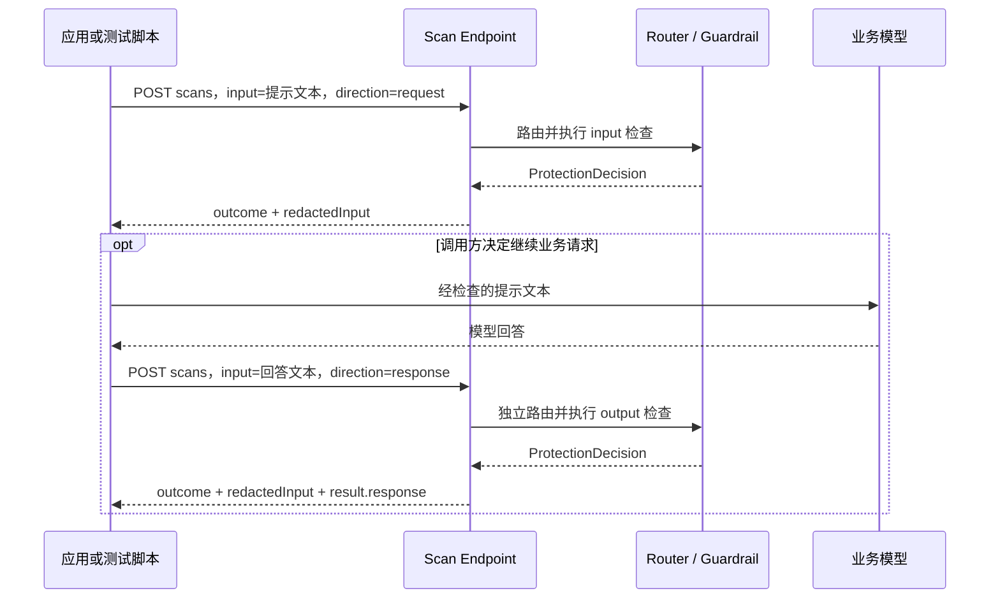

# Scan Endpoint 兼容接口技术设计

日期：2026-10-08。实现更新：2026-10-09。状态：已实现本文件定义的 Scan 兼容契约，F5 实例对照联调尚未进行。

## 1. 目标与设计结论

新增 `Scan（F5 兼容）` Endpoint，提供 `POST /backend/v1/scans`。已有 Python / requests / curl 测试脚本只需替换服务地址和凭据，即可提交文本、读取 `result.outcome`，使用同一批数据评测 TaskLattice Guard。

执行链保持为 **Endpoint → 绑定的 Router → 路由命中的 Guardrail Version → 扫描结果**。调用方不需要选择 Scanner，也不需要配置 F5 Project。内部适配器标识约定为 `f5-scan`，协议标识为 `scan`。

请求中只有四个字段具有执行语义：`input`、`scanDirection`、`flagOnly`、`verbose`。F5 的另外六个字段保留名称，接受任意合法 JSON 值并忽略。未知顶层字段也忽略。占位字段不能覆盖路由、修改规则、建立会话或切换身份。

兼容承诺是本文件定义的 **Scan HTTP 请求与响应契约**，以及不依赖占位字段语义的客户端。依赖 F5 Project、按请求启停 Scanner、Prompt 关联或逐 Scanner 配置的程序，虽然请求可以被接受，其原有行为不会被复现。检测效果由实际命中的 TaskLattice Guardrail 决定。

### 1.1 规范基线

外部依据为 [F5 Scan API](https://docs.aisecurity.f5.com/operations/post_scans.html) 和 [公开 OpenAPI](https://docs.aisecurity.f5.com/openapi.json)，本次检查的 OpenAPI `info.version` 为 `10.110.0`，这是规范文件版本，不代表所有 F5 部署的运行版本。重点类型为 `PostScansBody`、`PostScansResponse`、`ScanRequestResult`、`Scan`。

F5 的 Schema 规定只有 `input` 必填；`scanDirection` 默认 `request`，`flagOnly` 默认 `true`，`verbose` 默认 `false`。`PromptOutcome` 的枚举有 `cleared / flagged / redacted / blocked` 四种，不能依据其部分描述文字中的两个值缩减枚举。

以下标为“本实现”的行为是 TaskLattice 的明确设计选择，尤其是占位字段、详细结果粒度、错误处理及阻断时的文本返回规则；不将这些选择表述为已经观测到的 F5 行为。

## 2. 接入地址、认证与 Endpoint 定位

```http
POST /backend/v1/scans HTTP/1.1
Authorization: Bearer <TASKLATTICE_ENDPOINT_API_KEY>
Content-Type: application/json
Accept: application/json
```

服务直接返回一次完整的 JSON 响应。内容命中、脱敏、阻断都属于扫描成功，使用 HTTP `200`；协议、认证或执行失败使用非 `2xx`。

路径中没有 Endpoint ID，因此 **Bearer 凭据既用于认证，也用于定位 Endpoint**：

1. Runner 对凭据计算摘要，在当前已同步的有效凭据中定位唯一 Endpoint。
2. 校验凭据未撤销、Endpoint 可用，且适配器为 `f5-scan`。
3. 使用该 Endpoint 绑定的 Router 解析实际 Guardrail Version。
4. 在选定执行快照上完成本次扫描，记录路由与版本证据。

复用现有 Endpoint API Key，不要求令牌是 JWT，也不要求用户提供 F5 的真实令牌。`project` 无论是什么值，都不能改变以上步骤。第一版仅使用 `Authorization: Bearer`，不要求额外的 Endpoint 请求头或 `x-api-key`。

Runner 已补充“有效凭据摘要 → Endpoint”的索引，在配置应用时原子更新；撤销凭据或移除 Endpoint 时同步移除。一个有效摘要不能指向多个 Endpoint，出现歧义时拒绝认证并记录配置错误。不得在每次扫描时访问 Controller 数据库，也不得在未定位到 Endpoint 时退回默认 Guardrail。

### 2.1 必须暴露根路径

[F5 DevCentral prompt-evaluator 的调用代码](https://github.com/f5devcentral/prompt-evaluator/blob/9f83919c59a6d8392998cd5903b7642425dda66f/prompt_evaluator.py#L43) 从域名根路径构造 `/backend/v1/scans`。仅提供 `/runtime/v1/endpoints/{id}/backend/v1/scans` 无法满足该脚本只改地址的目标。

对外 Runtime 域名必须把精确路径 `/backend/v1/scans` 转发至 Runner。若与管理界面共用域名，Ingress 必须为这个路径配置独立规则，避免落入 Controller 的 `/` 页面路由。第一版不依赖重定向，也不提供无认证的兼容转发。

## 3. Incoming JSON Request

### 3.1 字段契约

字段名大小写与 F5 一致。默认值只对字段缺失生效；四个有效字段传入 `null` 或错误类型时返回 `422`，不进行字符串、数字到布尔值的隐式转换。

| 字段 | F5 规范类型 / 默认值 | 本实现处理 |
| --- | --- | --- |
| `input` | 必填 `string` | **有效。** 本次扫描的唯一文本，保留换行、空格、Unicode 和原始内容；不自动解包其中的 JSON |
| `scanDirection` | `request` 或 `response`；默认 `request` | **有效。** 分别映射到 Guardrail 的 input 或 output 阶段 |
| `flagOnly` | `boolean`；默认 `true` | **有效。** 控制成功响应的总体 outcome 表达方式，不改变路由和 Guardrail 执行动作 |
| `verbose` | `boolean`；默认 `false` | **有效。** 控制是否返回 `scannerResults` 执行详情，不增减实际检查 |
| `project` | UUID / 名称字符串或 `null` | **兼容占位，任意 JSON 值均忽略。** 不选择项目、Endpoint、Router 或 Guardrail |
| `externalMetadata` | 对象或 `null` | **兼容占位，任意 JSON 值均忽略。** 不作为路由属性、标签、业务上下文或可查询元数据 |
| `requestPromptId` | UUID 或 `null` | **兼容占位，任意 JSON 值均忽略。** 不建立请求与响应关联，不作为内部 `call_id` |
| `configOverrides` | 对象；默认 `{}` | **兼容占位，任意 JSON 值均忽略。** 不覆盖阈值、动作、正则、提示词或其他配置 |
| `disabled` | UUID 数组；默认 `[]` | **兼容占位，任意 JSON 值均忽略。** 不能禁用任何规则 |
| `forceEnabled` | UUID 数组；默认 `[]` | **兼容占位，任意 JSON 值均忽略。** 不能启用或增加任何规则 |
| 其他顶层字段 | 不在本契约中 | 接受并忽略；不递归解释其中的配置、角色或指令 |

占位字段的统一说明为：**“此字段不适用于 TaskLattice Guard，仅为 F5 Scan 请求兼容保留；可以省略，传入任意合法 JSON 值均被忽略。”** 接口文档和生成的 Schema 均须明确表达这一语义。

占位字段在有效字段校验前剔除，不调用 F5 的 UUID、数组元素或配置 Schema 校验器。例如 `disabled: "anything"`、`project: 123` 都可以接受。有效字段仍严格校验，例如 `flagOnly: "false"` 不等于 `false`。

“忽略”指不影响业务行为；整个请求仍须是合法 JSON 对象，并受统一的请求体大小限制。第一版默认上限为 1 MiB，可通过 `GUARD_SCAN_MAX_BODY_BYTES`（Helm：`runner.scan.maxBodyBytes`）调整，超出返回 `413`。不额外强制非空文本：`input: ""` 是合法字符串，但仍走正常执行与覆盖检查，不能直接返回 `cleared`。

### 3.2 最小请求

下面的请求等价于 `scanDirection=request`、`flagOnly=true`、`verbose=false`。

```json
{
  "input": "请介绍一下你能提供的服务。"
}
```

### 3.3 包含全部 F5 字段的请求

```json
{
  "input": "联系邮箱是 alice@example.com。",
  "scanDirection": "request",
  "flagOnly": false,
  "verbose": true,
  "project": "legacy-f5-project",
  "externalMetadata": {
    "dataset": "pii-regression",
    "case_id": "case-001"
  },
  "requestPromptId": null,
  "configOverrides": {},
  "disabled": [],
  "forceEnabled": []
}
```

只有前四个字段生效。即使将 `configOverrides`、`disabled`、`forceEnabled` 填为非空，执行配置仍完全由本 Endpoint 的路由与发布配置决定。

### 3.4 扫描已经生成的模型回答

```json
{
  "input": "这是模型已经生成、尚未发送给最终用户的回答。",
  "scanDirection": "response",
  "flagOnly": false,
  "verbose": false,
  "requestPromptId": "c2b4e250-79f3-4e95-8537-d6a81ce89112"
}
```

这里的 `input` 放模型回答，不要求改成 `response` 字段，也不要求传整个 OpenAI / LiteLLM 响应对象。`requestPromptId` 被忽略；即使没有先做 request 扫描，本次 response 扫描也必须能够独立进入 output 阶段。

### 3.5 本实现的请求 JSON Schema

该 Schema 定义本适配器接受的请求，不冒充 F5 原版 Schema。占位字段故意不声明 `type`，以接受任意合法 JSON 值；`x-tasklattice-effect` 是文档注解。

```json
{
  "$schema": "https://json-schema.org/draft/2020-12/schema",
  "title": "TaskLatticeScanRequest",
  "type": "object",
  "required": ["input"],
  "additionalProperties": true,
  "properties": {
    "input": {"type": "string"},
    "scanDirection": {"type": "string", "enum": ["request", "response"], "default": "request"},
    "flagOnly": {"type": "boolean", "default": true},
    "verbose": {"type": "boolean", "default": false},
    "project": {"description": "不适用；仅兼容占位，任意 JSON 值均忽略。", "x-tasklattice-effect": "ignored"},
    "externalMetadata": {"description": "不适用；仅兼容占位，任意 JSON 值均忽略。", "x-tasklattice-effect": "ignored"},
    "requestPromptId": {"description": "不适用；仅兼容占位，任意 JSON 值均忽略。", "x-tasklattice-effect": "ignored"},
    "configOverrides": {"description": "不适用；仅兼容占位，任意 JSON 值均忽略。", "x-tasklattice-effect": "ignored"},
    "disabled": {"description": "不适用；仅兼容占位，任意 JSON 值均忽略。", "x-tasklattice-effect": "ignored"},
    "forceEnabled": {"description": "不适用；仅兼容占位，任意 JSON 值均忽略。", "x-tasklattice-effect": "ignored"}
  }
}
```

## 4. 如何处理业务 Request 与业务 Response

这里区分两种“响应”：**业务 Response** 是待审核的模型回答；**Scan HTTP Response** 是 Guard 返回的检测结果。两种扫描均以 HTTP POST 进站，并返回同一种检测结果结构。

| 调用时机 | 提交内容 | `scanDirection` | 内部阶段 | 后续业务动作 |
| --- | --- | --- | --- | --- |
| 调用业务模型之前 | 用户输入或调用方提取的提示文本 | `request` | `input` | 调用方依据结果决定是否请求模型、是否采用替换文本 |
| 业务模型已经生成回答之后 | 尚未交付用户的回答文本 | `response` | `output` | 调用方依据结果决定是否交付、替换或拒绝回答 |

Scan 本身不代调用方请求业务模型，也不会自动进行“输入扫描 → 生成回答 → 输出扫描”。用于检测的 Guardrail 可以调用自身配置的评估模型。这与 [F5 对 Prompts 和 Scans 的区分](https://docs.aisecurity.f5.com/api-docs/prompts-scans.html)一致。



图中 `direction` 是 `scanDirection` 的简写。离线数据集测试可以只执行任一方向的一次扫描。

### 4.1 转换为内部请求

| Scan 内容 | `ProtectionRequest` / `RequestContext` |
| --- | --- |
| `input` | 单一 `texts` 元素及一个内容块；文本不拼接、不重写 |
| `request` | `phase=input`；内容块 `role=user_input`、`source=user_input` |
| `response` | `phase=output`；内容块 `role=model_output`、`source=model_output` |
| 任意方向的内容块 | `trust=untrusted`，不能从被忽略的字段注入可信 system 指令 |
| 身份与协议 | `protocol=scan`、认证得到的 `endpoint_id`，沿用现有可信身份字段 |
| HTTP 上下文 | 实际请求的 method、host、path 及现有规则允许使用的请求头 |
| 扫描方向 | 作为 `adapter.field` 的 `scan.direction` 提供，声明相应路由能力 |
| `flagOnly` | 保留在适配器中；内部 `mode` 始终为 `enforce` |
| `verbose` | 保留在响应序列化层；决策所需执行证据始终收集 |
| 六个占位字段与未知字段 | 不进入执行上下文、路由属性、messages 或引擎参数 |

只记录真实 Scan HTTP 上下文；无法从这个协议知道原业务请求的 URL、模型名、tool name 或 JWT claims，因此不推测、不从占位字段补齐。依赖这些不可用信息的路由不会凭空匹配。`scan.direction` 可按既有 `adapter.field` 能力实现，无须新增第二套路由语言。

### 4.2 独立调用生命周期

现有 Runtime 支持用 `call_id` 固定输入与输出的执行上下文；Scan 第一版使用独立调用语义。每次生成服务端 UUID `scan_id`，路由一次，执行一次，然后完成该次路由事件。

建议在 Runtime 增加内部 `evaluate_standalone` 入口，复用既有解析、内容执行和结果组合代码；允许 output 首次进入，始终在成功、阻断、异常、超时和取消路径完成生命周期。不得简单伪造一个不存在的会话 `call_id` 调用现有相关输出路径，也不得重复路由或重复发送 completion。

`scan_id` 用作日志关联和独立调用的路由分配标识，不来自 `requestPromptId` 或其他请求体字段。执行期间固定已选快照，并遵守现有快照保留与释放规则。一次 input 扫描完成后不等待将来出现的 output 扫描。

两次扫描可能因加权分发或期间的发布变更命中不同版本。这是独立 Scan 的既定行为。需要 input/output 使用同一会话快照的场景继续使用现有支持关联调用的协议，不把已声明忽略的 `requestPromptId` 暗中变成控制字段。

输出扫描只有回答文本。需要原始问题、检索材料或历史上下文的检查可能无法完成，应返回明确的执行错误；不从之前的 Scan、忽略字段或日志中自动补齐上下文。

## 5. Outgoing JSON Response

### 5.1 成功响应字段

成功响应始终返回以下外形；所有字段都由服务端生成，不透传请求中的同名未知字段。

| 路径 | 类型 | 本实现语义 |
| --- | --- | --- |
| `id` | UUID 字符串 | 本次 `scan_id`，与运行日志关联；不代表实现了 F5 历史查询接口 |
| `result.outcome` | 四种枚举字符串 | 按下表映射实际判定 |
| `result.response` | 字符串或 `null` | request 扫描固定 `null`；response 扫描按 5.3 节生成 |
| `result.scannerResults` | 数组 | `verbose=false` 返回 `[]`；`true` 返回本次 Guardrail 执行的详情 |
| `redactedInput` | 字符串 | 实际变换后的文本；未变换则保留原文，详见 5.3 节 |
| `scanners` | `null` | **兼容占位。** 不返回 F5 Project Scanner 配置清单；不表示没有执行 Guardrail |

HTTP 响应增加 `X-TaskLattice-Scan-Compatibility: v1` 和 `X-Request-ID: <scan_id>`。不在成功 Body 中增加强制解析的新字段，也不要求旧脚本读取这些响应头。

### 5.2 `outcome` 与 `flagOnly`

[F5 的 flagOnly 发布说明](https://docs.aisecurity.f5.com/release-notes/2026-03-30-saas.html)明确：配置为阻断的命中，省略或传 `true` 时报告 `flagged`，传 `false` 时报告 `blocked`。本实现采用以下完整映射。

先检查扫描是否有效完成，再映射内容结果。`matched` 表示权威的最终检测结果确认命中；不能用“trace 非空”“出现过模型调用”或“中间重试曾命中”替代。

| 有效完成的 Guardrail 结果 | `flagOnly=true` 或省略 | `flagOnly=false` |
| --- | --- | --- |
| 无风险命中，允许 | `cleared` | `cleared` |
| 已命中，但配置只记录/允许 | `flagged` | `flagged` |
| 内容策略要求变换文本，含脱敏或替换 | `flagged` | `redacted` |
| 内容策略要求阻断 | `flagged` | `blocked` |

变换动作统一报告 `redacted`，这是对 TaskLattice transform 动作的协议映射，可能包括全文替换，不承诺都是局部 PII 遮盖。最终 block 优先于 transform，使用 Runtime 已组合完成的最终动作，不在适配器重跑策略。

`flagOnly` 仅改变上表中的汇总标签，**不等于内部 `mode=detect`，不关闭阻断规则，也不修改替换文本**。Scan 只报告检查结果；如何处理 `flagged` 由调用方决定。要据此执行实际业务放行/阻断，建议显式传 `flagOnly=false`。

适配器需要取得最终 findings / assessments / rail verdict 以及最终动作。若现有 `evidence_scope=interventions` 会丢失“命中但允许”的证据，应使用 `full` 或补充等价的内部汇总字段；不能因 `verbose=false` 而漏判。

### 5.3 文本字段：检测对象与可交付回答分开

本实现规定：

| 最终内部动作 | `redactedInput` | request 扫描的 `result.response` | response 扫描的 `result.response` |
| --- | --- | --- | --- |
| allow，无论是否仅标记 | 原始 `input` | `null` | 原始 `input` |
| transform | 该内容块最终变换后的文本 | `null` | 同 `redactedInput` |
| block | 仅当 Runtime 提供最终变换文本时返回它，否则原始 `input` | `null` | `null` |

`redactedInput` 是检测文本经过实际变换后的表示，**不是放行凭证**；阻断时可能仍含原文。调用方必须先看 outcome，再决定如何使用文本。上述 block 和 `result.response` 的取值是本兼容层的明确约定，尚未用 F5 实例逐项比对。

变换结果为空字符串是有效结果，不得使用 `replacement or original` 回退原文。若 Runtime 声称 transform 却没有该单一内容块的最终文本，按内部错误返回 `500`。不把异常消息、模型推理过程或内部提示词当作 `result.response`。

### 5.4 `verbose=true` 的详情粒度

本系统没有额外的 F5 Scanner 资源模型。第一版将 **路由选中的整个 Guardrail 的本次执行** 映射为一个 `scannerResults` 元素；内部各 Policy 的执行证据保留在日志中。这是明示的聚合粒度，不承诺逐 F5 Scanner 类型、命中位置或置信度格式。

| 元素字段 | 本实现值 |
| --- | --- |
| `outcome` | 未命中为 `passed`，命中或内容变换/阻断为 `failed`；它表示内容判定，不表示 HTTP 执行异常 |
| `scanDirection` | 本次实际方向 |
| `scannerId` | 实际 Guardrail ID 是 UUID 时使用该值，否则 `null`；不生成虚构的 Scanner ID |
| `startedDate` / `completedDate` | 本次 Guardrail 执行的真实 UTC 时间，ISO 8601 格式 |
| `data` | `{"type":"custom"}`，使用 F5 Schema 接受的通用结果类型；不冒充 regex / keyword 详情 |
| `message` | 第一版固定 `null`，不适用；内部原因在受控日志中查看 |
| `scannerVersionMeta` | 固定 `null`，兼容占位；真实 Guardrail Version 在执行日志记录 |
| `customConfig` | 固定 `false`，表示没有应用请求级 F5 配置覆盖 |

不返回虚构的 `tokenUsage: 0`；第一版省略该可选字段，真实用量按本系统遥测记录。`verbose=false` 的空数组只表示省略详情，不能被解释为跳过检测。

### 5.5 完整响应案例

以下为设计示例，UUID、时间和检测结果不是实测数据。

**A. 默认输入扫描，未命中，HTTP 200。**

```json
{
  "id": "45da50ee-ff09-486f-bd4b-ff73a49ecbc1",
  "result": {
    "outcome": "cleared",
    "response": null,
    "scannerResults": []
  },
  "redactedInput": "请介绍一下你能提供的服务。",
  "scanners": null
}
```

**B. 默认输入扫描，内容策略要求阻断，但 `flagOnly=true`，HTTP 200。**

```json
{
  "id": "848ac160-510d-4529-807d-d39c35b89cde",
  "result": {
    "outcome": "flagged",
    "response": null,
    "scannerResults": []
  },
  "redactedInput": "这是一条命中阻断规则的测试文本。",
  "scanners": null
}
```

**C. 输出扫描发生脱敏，`flagOnly=false`、`verbose=true`，HTTP 200。**

```json
{
  "id": "172506ca-5a3e-46c3-a71c-89e95d21e164",
  "result": {
    "outcome": "redacted",
    "response": "联系邮箱是 [EMAIL]。",
    "scannerResults": [
      {
        "outcome": "failed",
        "data": {"type": "custom"},
        "startedDate": "2026-10-08T04:00:00.000Z",
        "completedDate": "2026-10-08T04:00:00.120Z",
        "scanDirection": "response",
        "scannerId": "5e96e4bb-799e-499f-ab83-c75dd7ff28b8",
        "scannerVersionMeta": null,
        "message": null,
        "customConfig": false
      }
    ]
  },
  "redactedInput": "联系邮箱是 [EMAIL]。",
  "scanners": null
}
```

**D. 输出扫描要求阻断，`flagOnly=false`，HTTP 200。**

```json
{
  "id": "08f1c833-ff57-4b53-aeac-f6834a9d2736",
  "result": {
    "outcome": "blocked",
    "response": null,
    "scannerResults": []
  },
  "redactedInput": "这是一条被阻断的模型回答。",
  "scanners": null
}
```

## 6. 执行失败与错误响应

`cleared` 必须建立在该阶段所要求的检查有效完成且未命中的证据上。模型超时、调用错误、没有适用检查、缺少必需上下文，以及无法解释的未执行状态，均不能转换成 `cleared`。

本 Scan 兼容层选择严格的评测语义：即使底层允许 fail-open，只要必需检查失败、结果未知或覆盖不足，本次也报告执行错误。底层因基础设施错误而 fail-closed 的 block 同样属于执行错误，不包装成“检测命中”的 `blocked`。有明确策略短路证据的正常内容阻断不算执行失败，未到达的后续规则不得伪造为 passed。

| HTTP 状态 | 条件 |
| --- | --- |
| `401` | 缺失、无效、撤销、Endpoint 已停用并从 Runner 配置移除，或无法唯一定位 Endpoint 的 Bearer 凭据；返回 `WWW-Authenticate: Bearer` |
| `403` | 已认证的 Endpoint 类型不支持 Scan |
| `413` | 请求体超过部署限制 |
| `415` | 不支持的 Content-Type；接受 `application/json` 及其 charset 参数 |
| `422` | 非法 JSON、顶层非对象、缺失 `input`、有效字段类型或方向值错误 |
| `429` | 部署启用了限流且触发限制；有重试时间时返回 `Retry-After` |
| `503` | 路由/版本不可用、必需检测执行失败、缺少上下文、没有有效覆盖 |
| `504` | 扫描超时 |
| `500` | 内部实现错误或结果违反契约 |

除 `422` 外，适配器可控制的错误采用下面的 TaskLattice 格式，并返回 `X-Request-ID`。不声称逐字兼容 F5 的全部错误文案；入口代理自身拒绝的请求可能使用代理错误格式。

```json
{
  "detail": {
    "code": "scan_execution_failed",
    "message": "The required scan could not be completed.",
    "requestId": "24d9f92b-d311-4c32-a78c-28a4a25905f0"
  }
}
```

`422` 保留 F5 OpenAPI 中 `HTTPValidationError` 的 `detail` 数组外形，省略敏感输入回显：

```json
{
  "detail": [
    {
      "loc": ["body", "input"],
      "msg": "Input should be a valid string",
      "type": "string_type"
    }
  ]
}
```

服务端 deadline 默认 25 秒，可通过 `GUARD_SCAN_TIMEOUT_SECONDS`（Helm：`runner.scan.timeoutSeconds`）调整。公开脚本单次调用设置了 30 秒超时，联调时应使服务端和入口代理留出返回错误的时间，例如服务端设为 25 秒；这是部署建议，不是 F5 时延承诺。客户端重试视为新的 Scan，可能再次计费并重新路由，不提供隐含的幂等或去重语义。

## 7. 日志、产品配置与改动位置

新增 Endpoint 时，用户选择“Scan（F5 兼容）”、绑定现有 Router、创建凭据。接入页展示 URL、Bearer Header、最小请求和占位字段说明。无需增加 Project、Scanner ID、Scanner 列表或检测配置覆盖表单。

日志沿用 Endpoint 的采集和保留策略，关联 `scan_id`、方向、内部动作、兼容 outcome、耗时、实际 Guardrail ID/Version、Router、route assignment、release 和 model revision。`flagOnly` 和 `verbose` 可用于解释返回格式。真实执行证据不塞进 F5 的占位字段。

认证头继续脱敏。占位字段不建立查询索引、不传入路由和引擎；若现有受控原始请求采集开启，原始 Body 仍可能包含这些值，因此“忽略”不等于“保证未存储”。普通日志不单独打印占位字段值或完整待测文本。

| 层 | 当前入口 / 文件 | 实现内容 |
| --- | --- | --- |
| HTTP 接入 | [runner/scan.py](../runner/scan.py)、[runner/api.py](../runner/api.py) | 新增固定 Scan 路由、严格有效字段模型、忽略字段处理、Bearer 认证、响应与错误映射 |
| 凭据与配置快照 | [runner/artifact_store.py](../runner/artifact_store.py) | 有效摘要反查 Endpoint；随配置同步更新索引 |
| Runtime 生命周期 | [runtime/service.py](../runner/toolkit/runtime/service.py) | 独立 Scan 调用入口，复用既有执行逻辑，完整发送 assignment/completion |
| 执行证据 | [runtime/contracts.py](../runner/toolkit/runtime/contracts.py)、[nemo/runtime.py](../runner/toolkit/nemo/runtime.py) | 验证最终命中、未知、错误、覆盖和变换文本能可靠区分；需要时补充汇总能力 |
| 路由能力 | [runner/routing.py](../runner/routing.py)、[traffic-routing.ts](../controller/shared/traffic-routing.ts) | 声明 `scan` 协议和 `scan.direction` 能力；复用 Endpoint 已绑定 Router |
| Endpoint 管理 | [api-types.ts](../controller/src/lib/api-types.ts)、[endpoints-api.ts](../controller/src/lib/endpoints-api.ts)、[endpoints.tsx](../controller/src/routes/endpoints.tsx) | 注册 `f5-scan`，补齐桌面管理界面的类型和显示文案 |
| 接入说明生成 | [control-plane.ts](../controller/server/services/control-plane.ts) 的 `endpointSetup` | 生成根路径 URL、Bearer 和 Scan 示例，不生成 LiteLLM 配置或流式回调地址 |
| Playground / Testing | [playground/service.ts](../controller/server/playground/service.ts) 及接入适配器 | 添加选定 Scan Endpoint 的调用能力与路径许可，确认所用凭据属于该 Endpoint |
| 对外暴露 | [ingress.yaml](../charts/tali-guard/templates/ingress.yaml) 或部署的 Runtime 入口 | 将 `/backend/v1/scans` 转发 Runner，确认并发副本共享同一已同步凭据/配置语义 |

表中列出了本次实现涉及的接入位置。适配器字符串沿用现有配置分发结构；路由能力、Playground 路径许可和凭据归属校验、中英文接入说明与桌面界面已同步更新。Scan 类型使用 F5 标识。

## 8. 验收与公开脚本复用

### 8.1 契约验收矩阵

| 场景 | 必须验证的结果 |
| --- | --- |
| 仅传 `input` | 使用三个默认值；有效扫描的 outcome 仅为 cleared / flagged |
| request / response 独立调用 | 分别进入正确阶段；response 不要求先产生 input 会话 |
| allow / 命中但允许 / transform / block | 与 `flagOnly` 两种值的映射表一致；内容 block 仍返回 HTTP 200 |
| `verbose` 开关 | 不改变实际路由、检测配置、动作和文本；只改变详情数组 |
| 六个占位字段逐个及组合 | 缺省、null、字符串、数字、布尔、数组、对象均可接受；非空启停/覆盖配置同样忽略 |
| 占位字段不产生行为影响 | 固定路由和确定性规则时，响应语义相同；检查进入路由/Runtime 的规范化请求相同 |
| 未知字段与有效字段 | 未知字段忽略；有效字段错误类型拒绝，不因 extra=ignore 放松核心校验 |
| 文本边界 | Unicode、换行、空字符串、空替换、体积上限；不截断、不拼接、不回退敏感原文 |
| 详细结果 | 时间和 Guardrail 身份可追溯；不编造 regex 命中、token 数量或已执行规则 |
| 认证及同步 | 不同 Endpoint 凭据正确分流；撤销、禁用、类型不符、摘要冲突按约定失败 |
| 运行失败 | 无路由、无可用版本、超时、模型错误、未知判定和无有效覆盖都不返回 cleared |
| 并发与生命周期 | 每次仅一份路由分配与完成记录；独立 input 不残留待完成会话；取消可释放资源 |
| 配置更新与加权路由 | 单次调用固定快照；调用之间允许命中不同版本，证据归属准确 |
| 原有协议回归 | LiteLLM 的认证、输入输出关联、流式保护和结果映射保持原有契约；Endpoint 类型只保留 LiteLLM 与 Scan |

“字段忽略”和 `verbose` 不影响路由的测试应固定路由分配条件；不能把两次独立加权随机命中的差异误认成字段产生了影响。

### 8.2 使用已有 Python 数据集脚本验证

可优先使用 [f5devcentral/prompt-evaluator](https://github.com/f5devcentral/prompt-evaluator)。本次检查的串行脚本版本为 `9f83919c59a6d8392998cd5903b7642425dda66f`：发送 `{"input": prompt}`，使用 Bearer，读取 `result.outcome`。测试环境中保留原脚本和数据集，只修改：

```dotenv
CALYPSOAI_URL=https://guard-runtime.example.com
CALYPSOAI_TOKEN=<TASKLATTICE_ENDPOINT_API_KEY>
```

不要求在脚本中加入 `project` 或 Scanner ID。默认 `flagOnly=true` 正是为了兼容这类只统计 `cleared / flagged` 的二元分类脚本。该版本的混淆矩阵只纳入这两个 outcome，验收需另核对总样本数、有效结果数、错误数和超时数，不能让错误样本被排除后掩盖问题。

[F5 DevCentral 的 out-of-band 示例](https://github.com/f5devcentral/f5-ai-security-api-integration-examples/blob/main/examples/scans_api_out_of_band.py)可用于补充 `flagOnly=false` 和四种结果的客户端处理验证。该示例还会调用业务模型；Scan 契约测试应只复用其扫描调用与结果解析部分。

以上是公开调用示例，不是 F5 官方完整一致性认证套件。本文的 10 个 JSON 代码块已通过语法校验，四份成功响应示例通过 F5 公开 `PostScansResponse` Schema 校验；请求 Schema 已检查 48 组占位字段取值和 7 组核心字段无效输入。实现后，从固定版本的公开脚本中提取未经修改的 `calypsoai_scan` 函数，使用其原始 requests 调用访问本地 Runner，已验证正常文本返回 cleared、命中文本返回 flagged；另外验证了 request / response 与 flagOnly 两种值组合的四份真实 HTTP 响应均符合 F5 成功响应 Schema。这是本地兼容性 smoke test，尚未运行完整数据集，也未与真实 F5 实例做行为对照。

## 9. 第一版边界与交付状态

第一版提供同步文本扫描、四个有效请求字段、六个可忽略占位字段、四种总体结果、聚合执行详情、Bearer 凭据定位以及现有 Router 分发。以下能力不包含在此契约中：原始请求/SSE 扫描 `/scans/raw/{format}`、业务模型代理 `/prompts`、图片/音频、批量数组 Body、F5 Project/Scanner 管理、F5 历史查询和跨请求关联。

已实现 Runner 认证、独立执行和结果适配，以及 Endpoint 管理、Playground、Helm 根路径入口和日志。管理端标注“Scan（F5 兼容）”，接入说明列出被忽略字段和聚合详情粒度。当前交付为仓库代码，尚未部署到实际集群。

主要工作集中在固定路径的 Endpoint 身份解析、独立输出生命周期和判定证据映射。JSON 解析与字段占位本身较简单，也无须复制 F5 的项目和扫描器管理体系。

## 10. 实现验证记录（2026-10-09）

- Scan 专项测试：48 通过，覆盖两个方向、flagOnly 映射、严格字段类型、任意占位值、空替换、体积限制、认证与撤销、凭据冲突、真实 Router → NeMo 执行、执行失败、取消和超时。独立 response 无需先发送 request；每次完成后不残留会话。
- 数据面完整回归：617 通过、3 跳过；随后新增超时与错误断言并调整 deadline 所在层，相关 Runner / Scan / 路由回归为 87 通过、1 跳过。
- Helm 渲染与契约检查：58 通过、1 跳过；验证每个 Ingress host 的 Scan 精确路径指向 Runtime，并传入可配置的请求上限和 deadline。集群升级测试未启用。
- Controller 的 Endpoint 接入、Playground 路径和认证边界、路由能力、桌面界面及中英文文案测试：84 通过；TypeScript 类型检查和完整构建通过。
- 桌面浏览器使用实际构建产物和隔离 API 示例数据，检查 Scan 类型选择、创建后接入流程、F5 图标、详情页及兼容字段说明。此 UI 检查没有修改实际环境的 Endpoint。

运行命令：

```bash
.venv/bin/python -m pytest -q tests/data_plane/test_scan.py
.venv/bin/python -m pytest -q -m data_plane
.venv/bin/python -m pytest -q tests/test_helm_chart.py tests/contract/test_helm_upgrade.py
npm run typecheck --prefix controller
npm run build --prefix controller
```

创建 Scan Endpoint 后仍需绑定已发布 Router、等待 Runner 配置同步，再使用该 Endpoint 的 API Key 调用。真实集群的 DNS、TLS、Ingress Controller 和真实 F5 数据集对照属于部署后的联调范围。
